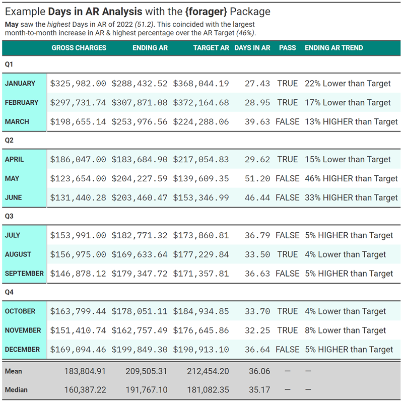
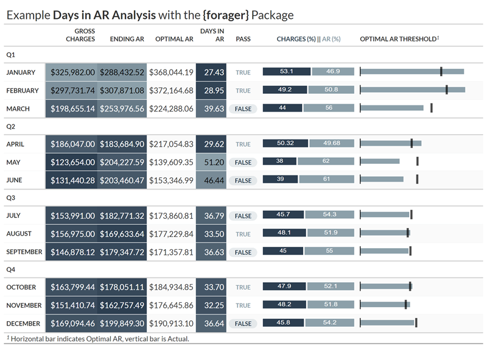
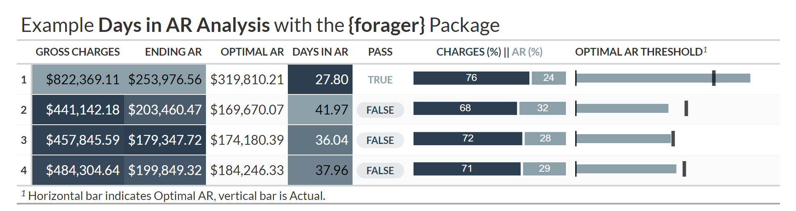

<!-- README.md is generated from README.Rmd. Please edit that file -->

```{r, include = FALSE}
knitr::opts_chunk$set(
  collapse  = TRUE,
  echo      = TRUE, 
  message   = FALSE, 
  warning   = FALSE,
  error     = TRUE,
  comment   = "#>",
  dpi       = 150, 
  out.width = "100%",
  fig.path  = "man/figures/README-"
)
```

# `forager` <a href="https://andrewallenbruce.github.io/forager/"></a>

> ***Forager** (noun)*
>
> *A person that goes from place to place searching for things that they
> can eat or use.*[^1]

> ***Ager** (noun)*
>
> *A person that calls from place to place searching for payment before
> insurance can refuse.*[^2]

<br>

<!-- badges: start -->

[](https://github.com/andrewallenbruce/forager/actions/workflows/R-CMD-check.yaml)
[](https://lifecycle.r-lib.org/articles/stages.html#experimental)
[](https://www.repostatus.org/#wip)
[](https://choosealicense.com/licenses/mit/)
[](https://github.com/andrewallenbruce/forager)
[](https://github.com/andrewallenbruce/forager/commits/master)
[](https://app.codecov.io/gh/andrewallenbruce/forager?branch=master)
<!-- badges: end -->

`forager` is a work-in-progress, the goal of which is to become a suite of integrated analytics tools focused on a comprehensive overview of a healthcare organization's operational and financial performance areas. Build your own rule-based, automated reporting pipeline to monitor:

  - Patient Scheduling
  - Coding / Billing
  - Productivity
  - Collections & A/R
  - Denial Management

## Installation

You can install the development version of `forager` from
[GitHub](https://github.com/) with:

``` r
# install.packages("devtools")
devtools::install_github("andrewallenbruce/forager")

# install.packages("remotes")
remotes::install_github("andrewallenbruce/forager")
```

```{r}
library(forager)
```

## Usage

Calculate: 

   * Provider Lag: Days between Date of Service (`dos`) and Date of Release (`dor`)
   * Billing Lag:  Days between Date of Release (`dor`) and Date of Submission (`dtos`)
   * Acceptance Lag:  Days between Date of Submission (`dtos`) and Date of Acceptance (`dtoa`)
   * Payment Lag: Days between Date of Acceptance (`dtoa`) and Date of Adjudication (`dtad`)
   * Days in AR: Days between Date of Release (`dor`) and Date of Adjudication (`dtad`)

```{r results='asis', echo=TRUE}
x <- forager::generate_data(1500)

x |> head(n = 25) |> gluedown::md_table()
```
<br>

```{r results='asis', echo=TRUE}
x |> 
  count_days(date_of_service, date_of_release, provider_lag) |> 
  count_days(date_of_release, date_of_submission, billing_lag) |> 
  count_days(date_of_submission, date_of_acceptance, processing_lag) |> 
  count_days(date_of_submission, date_of_adjudication, payer_lag) |> 
  count_days(date_of_release, date_of_adjudication, days_in_ar) |> 
  dplyr::group_by(month = clock::date_month_factor(date_of_service)) |> 
  dplyr::summarise(
       no_of_claims = dplyr::n(),
       balance_total = sum(balance),
       avg_prov_lag = round(mean(provider_lag), 2),
                      avg_bill_lag = round(mean(billing_lag), 2),
                      avg_accept_lag = round(mean(processing_lag), 2),
                      avg_pay_lag = round(mean(payer_lag), 2),
                      avg_dar = round(mean(days_in_ar), 2), .groups = "drop") |> 
  gluedown::md_table()
```

## Aging Calculation

```{r results='asis', echo=TRUE}
x |> forager::count_days(date_of_release, 
                         date_of_adjudication, 
                         days_in_ar) |> 
  dplyr::group_by(payer, 
                  aging_bucket = cut(days_in_ar, 
                                     breaks = seq(0, 500, 30))) |> 
  dplyr::summarise(no_of_claims = dplyr::n(),
                   balance_total = sum(balance), .groups = "drop") |> 
  gluedown::md_table()
```

## Days in AR Monthly Calculation

```{r results='asis', echo=TRUE}
y <- tibble::tibble(
  date = clock::date_build(2022, 1:12),
  gct = abs(rnorm(12, c(365000.567, 169094.46, 297731.74), c(2:3))),
  earb = abs(rnorm(12, c(182771.32, 169633.64, 179347.72), c(2:3))))

y |> 
  forager::dar_month(date, gct, earb, dart = 35) |> 
  gluedown::md_table()
```

<br>

## Days in AR Quarterly Calculation

```{r results='asis', echo=TRUE}
y |> forager::dar_qtr(date, gct, earb, 35) |> 
     gluedown::md_table()
```

<br>

### Presentation Examples

<details>

<summary>Click to View Code for Table</summary>

```{r eval=FALSE}
gt_1 <- dar_month_2022 |> 
  dplyr::select(month, gct, earb, earb_trg, dar, pass) |> 
  headliner::add_headline_column(x = earb, y = earb_trg, 
  headline = "{delta_p}% {trend} than Target", 
  trend_phrases = headliner::trend_terms(more = "HIGHER", less = "Lower"), n_decimal = 0) |> 
  gt::gt(rowname_col = "month") |> 
  gt::cols_label(gct = "Gross Charges",
                 earb = "Ending AR",
                 earb_trg = "Target AR",
                 dar = "Days in AR",
                 pass = "Pass",
                 headline = "Ending AR Trend") |> 
  gt::tab_row_group(label = "Q4", rows = c(10:12)) |>
  gt::tab_row_group(label = "Q3", rows = c(7:9)) |>
  gt::tab_row_group(label = "Q2", rows = c(4:6)) |>
  gt::tab_row_group(label = "Q1", rows = c(1:3)) |> 
  gt::fmt_number(columns = dar) |>
  gt::fmt_currency(columns = c(gct, earb, earb_trg)) |>
  gt::tab_style(style = gt::cell_text(font = c(gt::google_font(name = "IBM Plex Mono"),
  gt::default_fonts())), locations = gt::cells_body(columns = c(gct, earb, earb_trg, dar))) |> 
  gt::opt_stylize(style = 6, color = "cyan") |> 
  gt::tab_header(
    title = gt::md("Example **Days in AR Analysis** with the **{forager}** Package"), 
    subtitle = gt::md("**May** saw the *highest* Days in AR of 2022 *(51.2)*. This coincided with the largest <br> month-to-month increase in AR & highest percentage over the AR Target *(46%)*.")) |> 
  gt::opt_all_caps() |> 
  gt::grand_summary_rows(
    columns = c(gct, earb, earb_trg, dar),
    fns = list(Mean = ~mean(., na.rm = TRUE), Median = ~median(., na.rm = TRUE))) |> 
  gt::opt_table_font(font = list(gt::google_font(name = "Roboto"))) |> 
  gt::opt_align_table_header(align = "left")

#gt_1 |> gt::gtsave("gt_1.png", expand = 20)
```

</details>


{width="75%"}


<details>

<summary>Click to View Code for Table</summary>

```{r eval=FALSE}
# Create df for gt_plt_bar_stack
dar_month_2022_pct <- dar_month_2022 |>
  dplyr::mutate(gct_pct = (gct / (gct + earb) * 100),
         earb_pct = (earb / (gct + earb) * 100)) |>
  dplyr::select(month, gct_pct, earb_pct) |>
  tidyr::pivot_longer(-month, names_to = "measure", values_to = "percentage") |>
  dplyr::group_by(month) |>
  dplyr::summarize(list_data = list(percentage))

# Right join the two data frames
dar_month_2022_join <- dplyr::right_join(dar_month_2022, 
                                         dar_month_2022_pct, 
                                         by = "month")

# Create new copy cols for gt_plt_bullet
dar_month_2022_gt <- dar_month_2022_join |> 
  dplyr::select(month, 
                gct, 
                earb, 
                earb_trg, 
                dar, 
                pass,
                list_data) |>
  dplyr::mutate(target_col = earb, 
                plot_col = earb_trg)

# Create gt table
gt_2 <- dar_month_2022_gt |> 
  gt::gt(rowname_col = "month") |>
  gt::cols_label(
    #month = "Month",
                 gct = "Gross Charges",
                 earb = "Ending AR",
                 earb_trg = "Optimal AR",
                 dar = "Days in AR",
                 pass = "Pass",
                 plot_col = "Optimal AR Threshold") |>
  gt::tab_row_group(label = "Q4", rows = c(10:12)) |>
  gt::tab_row_group(label = "Q3", rows = c(7:9)) |>
  gt::tab_row_group(label = "Q2", rows = c(4:6)) |>
  gt::tab_row_group(label = "Q1", rows = c(1:3)) |> 
  #gt::tab_options(row_group.as_column = TRUE) |> 
  gtExtras::gt_theme_espn() |> 
  gt::fmt_number(columns = dar) |>
  gt::fmt_currency(columns = c(gct, earb, earb_trg)) |>
  #gtExtras::gt_plt_dot(dar, month, palette = c("#2c3e50", "#8ca0aa")) |> 
  gtExtras::gt_plt_bullet(column = plot_col, target = target_col, palette = c("#8ca0aa", "black"), width = 65) |>
  gtExtras::gt_plt_bar_stack(list_data, width = 50, labels = c("Charges (%) ", " AR (%)"), palette = c("#2c3e50", "#8ca0aa")) |>
  gtExtras::gt_badge(pass, palette = c("FALSE" = "#8ca0aa")) |> 
  gt::tab_style(style = gt::cell_text(color = "#2c3e50", weight = "bolder"), locations = gt::cells_body(columns = pass, rows = pass == "FALSE")) |>
  gt::tab_style(style = gt::cell_text(color = "#8ca0aa", weight = "normal"), locations = gt::cells_body(columns = pass, rows = pass == "TRUE")) |> 
  gt::data_color(columns = c(gct, earb, dar), colors = scales::col_numeric(palette = c("#2c3e50", "#8ca0aa") |> as.character(), domain = NULL)) |> 
  gt::tab_footnote(footnote = "Horizontal bar indicates Optimal AR, vertical bar is Actual.", locations = gt::cells_column_labels(columns = plot_col)) |> 
  gt::tab_header(title = gt::md("Example **Days in AR Analysis** with the **{forager}** Package"))

#gt_2 |> gt::gtsave("gt_2.png", expand = 20)
```

</details>


{width="75%"}

<br>

<details>

<summary>Click to View Code for Table</summary>

```{r eval=FALSE}
# Create df for gt_plt_bar_stack
dar_qtr_2022_pct <- dar_quarter_2022 |>
  dplyr::mutate(gct_pct = (gct_qtr / (gct_qtr + earb) * 100),
                earb_pct = (earb / (gct_qtr + earb) * 100)) |>
  dplyr::select(nqtr, gct_pct, earb_pct) |>
  tidyr::pivot_longer(-nqtr, 
                      names_to = "measure", 
                      values_to = "percentage") |>
  dplyr::group_by(nqtr) |>
  dplyr::summarize(list_data = list(percentage))

# Right join the two data frames
dar_qtr_2022_join <- dplyr::right_join(
  dar_quarter_2022, 
  dar_qtr_2022_pct, 
  by = "nqtr")

# Create new copy cols for gt_plt_bullet
dar_qtr_2022_gt <- dar_qtr_2022_join |> 
  dplyr::select(nqtr, 
                gct_qtr, 
                earb, 
                earb_trg, 
                dar, 
                pass,
                list_data) |>
  dplyr::mutate(target_col = earb, 
                plot_col = earb_trg)

# Create gt table
gt_qtr_2 <- dar_qtr_2022_gt |> 
  gt::gt(rowname_col = "nqtr") |>
  gt::cols_label(
    #month = "Month",
                 gct_qtr = "Gross Charges",
                 earb = "Ending AR",
                 earb_trg = "Optimal AR",
                 dar = "Days in AR",
                 pass = "Pass",
                 plot_col = "Optimal AR Threshold") |>
  # gt::tab_row_group(label = "Q4", rows = c(10:12)) |>
  # gt::tab_row_group(label = "Q3", rows = c(7:9)) |>
  # gt::tab_row_group(label = "Q2", rows = c(4:6)) |>
  # gt::tab_row_group(label = "Q1", rows = c(1:3)) |> 
  #gt::tab_options(row_group.as_column = TRUE) |> 
  gtExtras::gt_theme_espn() |> 
  gt::fmt_number(columns = dar) |>
  gt::fmt_currency(columns = c(gct_qtr, earb, earb_trg)) |>
  #gtExtras::gt_plt_dot(dar, month, palette = c("#2c3e50", "#8ca0aa")) |> 
  gtExtras::gt_plt_bullet(column = plot_col, target = target_col, palette = c("#8ca0aa", "black"), width = 65) |>
  gtExtras::gt_plt_bar_stack(list_data, width = 50, labels = c("Charges (%) ", " AR (%)"), palette = c("#2c3e50", "#8ca0aa")) |>
  gtExtras::gt_badge(pass, palette = c("FALSE" = "#8ca0aa")) |> 
  gt::tab_style(style = gt::cell_text(color = "#2c3e50", weight = "bolder"), locations = gt::cells_body(columns = pass, rows = pass == "FALSE")) |>
  gt::tab_style(style = gt::cell_text(color = "#8ca0aa", weight = "normal"), locations = gt::cells_body(columns = pass, rows = pass == "TRUE")) |> 
  gt::data_color(columns = c(gct_qtr, earb, dar), colors = scales::col_numeric(palette = c("#2c3e50", "#8ca0aa") |> as.character(), domain = NULL)) |> 
  gt::tab_footnote(footnote = "Horizontal bar indicates Optimal AR, vertical bar is Actual.", locations = gt::cells_column_labels(columns = plot_col)) |> 
  gt::tab_header(title = gt::md("Example **Days in AR Analysis** with the **{forager}** Package"))

#gt_qtr_2 |> gt::gtsave("gt_qtr_2.png", expand = 20)
```

</details>

{width="75%"}


## Code of Conduct

Please note that the `forager` project is released with a [Contributor
Code of
Conduct](https://andrewallenbruce.github.io/forager/CODE_OF_CONDUCT.html).
By contributing to this project, you agree to abide by its terms.

[^1]: <https://dictionary.cambridge.org/dictionary/english/forager>

[^2]: Me.

