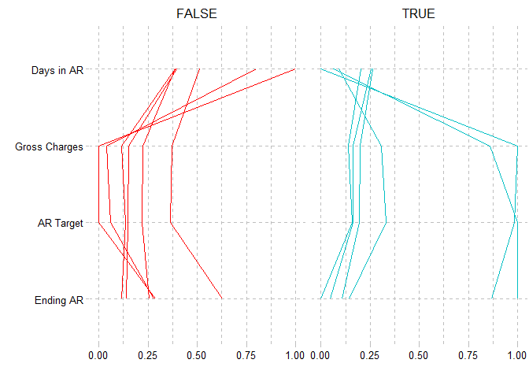
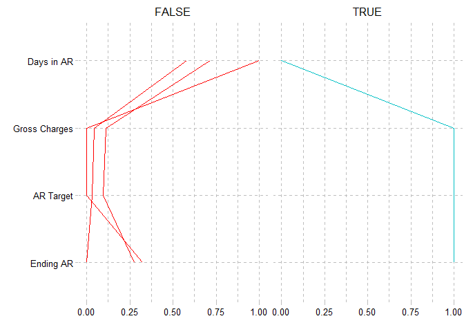

<!-- README.md is generated from README.Rmd. Please edit that file -->

# `forager` <a href="https://andrewallenbruce.github.io/forager/"></a>

> ***Forager** (noun)*
>
> *A person that goes from place to place searching for things that they
> can eat or use.*[^1]

> ***Ager** (noun)*
>
> *A person that calls from place to place searching for payment before
> insurance can refuse.*[^2]

<br>

<!-- badges: start -->

[](https://github.com/andrewallenbruce/forager/actions/workflows/R-CMD-check.yaml)
[](https://lifecycle.r-lib.org/articles/stages.html#experimental)
[](https://www.repostatus.org/#wip)
[](https://choosealicense.com/licenses/mit/)
[](https://github.com/andrewallenbruce/forager)
[](https://github.com/andrewallenbruce/forager/commits/master)

<!-- badges: end -->

The goal of {forager} is to provide a suite of tools for the analysis of
common healthcare revenue cycle management Key Performance Indicators
(KPIs).

## Installation

You can install the development version of forager from
[GitHub](https://github.com/) with:

``` r
# install.packages("devtools")
devtools::install_github("andrewallenbruce/forager")
```

## Aging Calculation

``` r
library(forager)
```

<br>

``` r
date_ex <- tibble::tibble(
  dos = as.POSIXct(
    c(
      "2022-02-10", "2022-02-09", "2022-02-08", "2022-02-08", "2022-02-07",
      "2022-02-07", "2022-02-05", "2022-02-05", "2022-02-02", "2022-02-02",
      "2022-02-02", "2022-02-01", "2022-02-01", "2022-02-01", "2022-01-31",
      "2022-01-30", "2022-01-30", "2022-01-29", "2022-01-29", "2022-01-28",
      "2022-01-28", "2022-01-28", "2022-01-21", "2022-01-21", "2022-01-20",
      "2022-01-20", "2022-01-20", "2022-01-08", "2022-01-07", "2021-12-31",
      "2021-12-31", "2021-12-31", "2021-12-31", "2021-12-31", "2021-12-27",
      "2021-12-27", "2021-12-26", "2021-12-26", "2021-12-25", "2021-12-25",
      "2021-12-25", "2021-12-25", "2021-12-25", "2021-12-25", "2021-12-19",
      "2021-12-18", "2021-12-08", "2021-11-27", "2021-11-20", "2021-11-20",
      "2021-11-19", "2021-11-19"
    ),
    tz = "UTC"
  ),
  dor = as.POSIXct(
    c(
      "2022-02-28", "2022-02-10", "2022-02-10", "2022-02-10", "2022-02-10",
      "2022-02-01", "2022-02-01", "2022-02-01", "2022-02-01", "2022-02-01",
      "2022-02-01", "2022-02-01", "2022-02-01", "2022-02-01", "2021-01-21",
      "2022-01-18", "2022-01-18", "2022-01-18", "2022-01-18", "2022-01-18",
      "2022-01-18", "2022-01-18", "2022-01-18", "2022-01-21", "2022-01-18",
      "2021-12-28", "2022-01-18", "2022-01-21", "2022-01-18", "2022-01-18",
      "2022-02-01", "2022-02-01", "2021-12-11", "2022-01-31", "2022-01-31",
      "2022-01-31", "2022-01-28", "2022-01-28", "2022-01-28", "2022-01-28",
      "2022-01-28", "2022-01-28", "2022-01-31", "2022-01-31", "2022-01-31",
      "2022-01-31", "2022-01-31", "2022-01-31", "2022-01-31", "2022-01-31",
      "2022-01-31", "2022-01-31"
    ),
    tz = "UTC"
  ),
)
```

<br> Calculate the number of days between the Date of Service (DOS) and
today’s date: <br>

``` r
date_ex |> 
  dplyr::select(dos) |> 
  dplyr::mutate(today = lubridate::today()) |> 
  forager::age_days(dos, today) |> 
  dplyr::arrange(desc(age))
#> # A tibble: 52 × 3
#>    dos                 today        age
#>    <dttm>              <date>     <dbl>
#>  1 2021-11-19 00:00:00 2022-09-06   293
#>  2 2021-11-19 00:00:00 2022-09-06   293
#>  3 2021-11-20 00:00:00 2022-09-06   292
#>  4 2021-11-20 00:00:00 2022-09-06   292
#>  5 2021-11-27 00:00:00 2022-09-06   285
#>  6 2021-12-08 00:00:00 2022-09-06   274
#>  7 2021-12-18 00:00:00 2022-09-06   264
#>  8 2021-12-19 00:00:00 2022-09-06   263
#>  9 2021-12-25 00:00:00 2022-09-06   257
#> 10 2021-12-25 00:00:00 2022-09-06   257
#> # … with 42 more rows
```

<br> Calculate the number of days between the Date of Service (DOS) and
the Date of Release (DOR): <br>

``` r
date_ex |> 
  dplyr::select(dos, dor) |>
  dplyr::filter(!is.na(dor)) |> 
  forager::age_days(dos, dor) |> 
  dplyr::arrange(desc(age))
#> # A tibble: 52 × 3
#>    dos                 dor                   age
#>    <dttm>              <dttm>              <dbl>
#>  1 2021-11-19 00:00:00 2022-01-31 00:00:00    74
#>  2 2021-11-19 00:00:00 2022-01-31 00:00:00    74
#>  3 2021-11-20 00:00:00 2022-01-31 00:00:00    73
#>  4 2021-11-20 00:00:00 2022-01-31 00:00:00    73
#>  5 2021-11-27 00:00:00 2022-01-31 00:00:00    66
#>  6 2021-12-08 00:00:00 2022-01-31 00:00:00    55
#>  7 2021-12-18 00:00:00 2022-01-31 00:00:00    45
#>  8 2021-12-19 00:00:00 2022-01-31 00:00:00    44
#>  9 2021-12-25 00:00:00 2022-01-31 00:00:00    38
#> 10 2021-12-25 00:00:00 2022-01-31 00:00:00    38
#> # … with 42 more rows
```

<br><br>

## Days in AR Monthly Calculation

The following is a basic example of a monthly Days in AR calculation:

``` r
# Example data frame
dar_mon_ex <- data.frame(
date = as.Date(c(
"2022-01-01", "2022-02-01", "2022-03-01",
"2022-04-01", "2022-05-01", "2022-06-01",
"2022-07-01", "2022-08-01", "2022-09-01",
"2022-10-01", "2022-11-01", "2022-12-01")),

gct = c(
325982.23, 297731.74, 198655.14,
186047.56, 123654.34, 131440.28,
153991.95, 156975.52, 146878.12,
163799.44, 151410.74, 169094.46),

earb = c(
288432.52, 307871.08, 253976.56,
183684.92, 204227.59, 203460.47,
182771.32, 169633.64, 179347.72,
178051.11, 162757.49, 199849.32))

dar_mon_ex |> 
  knitr::kable(col.names = c("Month", 
                             "Gross Charges", 
                             "Ending AR Balance"))
```

| Month      | Gross Charges | Ending AR Balance |
|:-----------|--------------:|------------------:|
| 2022-01-01 |      325982.2 |          288432.5 |
| 2022-02-01 |      297731.7 |          307871.1 |
| 2022-03-01 |      198655.1 |          253976.6 |
| 2022-04-01 |      186047.6 |          183684.9 |
| 2022-05-01 |      123654.3 |          204227.6 |
| 2022-06-01 |      131440.3 |          203460.5 |
| 2022-07-01 |      153992.0 |          182771.3 |
| 2022-08-01 |      156975.5 |          169633.6 |
| 2022-09-01 |      146878.1 |          179347.7 |
| 2022-10-01 |      163799.4 |          178051.1 |
| 2022-11-01 |      151410.7 |          162757.5 |
| 2022-12-01 |      169094.5 |          199849.3 |

<br>

Using the `dar_month()` function, we set the Days in AR target (`dart`)
to 35 and calculate:

<br>

``` r
dar_month_2022 <- dar_mon_ex |> forager::dar_month(date, gct, earb, 35)
```

<br>

| Month     | Gross Charges | Ending AR | Target AR | Days in AR | Pass  |
|:----------|--------------:|----------:|----------:|-----------:|:------|
| January   |      325982.2 |  288432.5 |  368044.5 |      27.43 | TRUE  |
| February  |      297731.7 |  307871.1 |  372164.7 |      28.95 | TRUE  |
| March     |      198655.1 |  253976.6 |  224288.1 |      39.63 | FALSE |
| April     |      186047.6 |  183684.9 |  217055.5 |      29.62 | TRUE  |
| May       |      123654.3 |  204227.6 |  139609.7 |      51.20 | FALSE |
| June      |      131440.3 |  203460.5 |  153347.0 |      46.44 | FALSE |
| July      |      153992.0 |  182771.3 |  173861.9 |      36.79 | FALSE |
| August    |      156975.5 |  169633.6 |  177230.4 |      33.50 | TRUE  |
| September |      146878.1 |  179347.7 |  171357.8 |      36.63 | FALSE |
| October   |      163799.4 |  178051.1 |  184934.9 |      33.70 | TRUE  |
| November  |      151410.7 |  162757.5 |  176645.9 |      32.25 | TRUE  |
| December  |      169094.5 |  199849.3 |  190913.1 |      36.64 | FALSE |

<br>

### Presentation Examples

<details>
<summary>
Click to View Code for Table
</summary>

``` r
gt_1 <- dar_month_2022 |> 
  dplyr::select(month, gct, earb, earb_trg, dar, pass) |> 
  headliner::add_headline_column(x = earb, y = earb_trg, 
  headline = "{delta_p}% {trend} than Target", 
  trend_phrases = headliner::trend_terms(more = "HIGHER", less = "Lower"), n_decimal = 0) |> 
  gt::gt(rowname_col = "month") |> 
  gt::cols_label(gct = "Gross Charges",
                 earb = "Ending AR",
                 earb_trg = "Target AR",
                 dar = "Days in AR",
                 pass = "Pass",
                 headline = "Ending AR Trend") |> 
  gt::tab_row_group(label = "Q4", rows = c(10:12)) |>
  gt::tab_row_group(label = "Q3", rows = c(7:9)) |>
  gt::tab_row_group(label = "Q2", rows = c(4:6)) |>
  gt::tab_row_group(label = "Q1", rows = c(1:3)) |> 
  gt::fmt_number(columns = dar) |>
  gt::fmt_currency(columns = c(gct, earb, earb_trg)) |>
  gt::tab_style(style = gt::cell_text(font = c(gt::google_font(name = "IBM Plex Mono"),
  gt::default_fonts())), locations = gt::cells_body(columns = c(gct, earb, earb_trg, dar))) |> 
  gt::opt_stylize(style = 6, color = "cyan") |> 
  gt::tab_header(
    title = gt::md("Example **Days in AR Analysis** with the **{forager}** Package"), 
    subtitle = gt::md("**May** saw the *highest* Days in AR of 2022 *(51.2)*. This coincided with the largest <br> month-to-month increase in AR & highest percentage over the AR Target *(46%)*.")) |> 
  gt::opt_all_caps() |> 
  gt::grand_summary_rows(
    columns = c(gct, earb, earb_trg, dar),
    fns = list(Mean = ~mean(., na.rm = TRUE), Median = ~median(., na.rm = TRUE))) |> 
  gt::opt_table_font(font = list(gt::google_font(name = "Roboto"))) |> 
  gt::opt_align_table_header(align = "left")

#gt_1 |> gt::gtsave("gt_1.png", expand = 20)
```

</details>


<details>
<summary>
Click to View Code for Table
</summary>

``` r
dar_month_2022
#>          date     month nmon ndip      gct     earb earb_trg   earb_dc earb_pct
#> 1  2022-01-01   January    1   31 325982.2 288432.5 368044.5 -79611.93   -27.60
#> 2  2022-02-01  February    2   28 297731.7 307871.1 372164.7 -64293.60   -20.88
#> 3  2022-03-01     March    3   31 198655.1 253976.6 224288.1  29688.50    11.69
#> 4  2022-04-01     April    4   30 186047.6 183684.9 217055.5 -33370.57   -18.17
#> 5  2022-05-01       May    5   31 123654.3 204227.6 139609.7  64617.85    31.64
#> 6  2022-06-01      June    6   30 131440.3 203460.5 153347.0  50113.48    24.63
#> 7  2022-07-01      July    7   31 153992.0 182771.3 173861.9   8909.44     4.87
#> 8  2022-08-01    August    8   31 156975.5 169633.6 177230.4  -7596.79    -4.48
#> 9  2022-09-01 September    9   30 146878.1 179347.7 171357.8   7989.91     4.45
#> 10 2022-10-01   October   10   31 163799.4 178051.1 184934.9  -6883.74    -3.87
#> 11 2022-11-01  November   11   30 151410.7 162757.5 176645.9 -13888.37    -8.53
#> 12 2022-12-01  December   12   31 169094.5 199849.3 190913.1   8936.22     4.47
#>         adc   dar  pass actual ideal radiff
#> 1  10515.56 27.43  TRUE   0.88  1.13  -0.25
#> 2  10633.28 28.95  TRUE   1.03  1.25  -0.22
#> 3   6408.23 39.63 FALSE   1.28  1.13   0.15
#> 4   6201.59 29.62  TRUE   0.99  1.17  -0.18
#> 5   3988.85 51.20 FALSE   1.65  1.13   0.52
#> 6   4381.34 46.44 FALSE   1.55  1.17   0.38
#> 7   4967.48 36.79 FALSE   1.19  1.13   0.06
#> 8   5063.73 33.50  TRUE   1.08  1.13  -0.05
#> 9   4895.94 36.63 FALSE   1.22  1.17   0.05
#> 10  5283.85 33.70  TRUE   1.09  1.13  -0.04
#> 11  5047.02 32.25  TRUE   1.07  1.17  -0.10
#> 12  5454.66 36.64 FALSE   1.18  1.13   0.05
```

``` r
# Create df for gt_plt_bar_stack
dar_month_2022_pct <- dar_month_2022 |>
  dplyr::mutate(gct_pct = (gct / (gct + earb) * 100),
         earb_pct = (earb / (gct + earb) * 100)) |>
  dplyr::select(month, gct_pct, earb_pct) |>
  tidyr::pivot_longer(-month, names_to = "measure", values_to = "percentage") |>
  dplyr::group_by(month) |>
  dplyr::summarize(list_data = list(percentage))

# Right join the two data frames
dar_month_2022_join <- dplyr::right_join(dar_month_2022, 
                                         dar_month_2022_pct, 
                                         by = "month")

# Create new copy cols for gt_plt_bullet
dar_month_2022_gt <- dar_month_2022_join |> 
  dplyr::select(month, 
                gct, 
                earb, 
                earb_trg, 
                dar, 
                pass,
                list_data) |>
  dplyr::mutate(target_col = earb, 
                plot_col = earb_trg)

# Create gt table
gt_2 <- dar_month_2022_gt |> 
  gt::gt(rowname_col = "month") |>
  gt::cols_label(
    #month = "Month",
                 gct = "Gross Charges",
                 earb = "Ending AR",
                 earb_trg = "Optimal AR",
                 dar = "Days in AR",
                 pass = "Pass",
                 plot_col = "Optimal AR Threshold") |>
  gt::tab_row_group(label = "Q4", rows = c(10:12)) |>
  gt::tab_row_group(label = "Q3", rows = c(7:9)) |>
  gt::tab_row_group(label = "Q2", rows = c(4:6)) |>
  gt::tab_row_group(label = "Q1", rows = c(1:3)) |> 
  #gt::tab_options(row_group.as_column = TRUE) |> 
  gtExtras::gt_theme_espn() |> 
  gt::fmt_number(columns = dar) |>
  gt::fmt_currency(columns = c(gct, earb, earb_trg)) |>
  #gtExtras::gt_plt_dot(dar, month, palette = c("#2c3e50", "#8ca0aa")) |> 
  gtExtras::gt_plt_bullet(column = plot_col, target = target_col, palette = c("#8ca0aa", "black"), width = 65) |>
  gtExtras::gt_plt_bar_stack(list_data, width = 50, labels = c("Charges (%) ", " AR (%)"), palette = c("#2c3e50", "#8ca0aa")) |>
  gtExtras::gt_badge(pass, palette = c("FALSE" = "#8ca0aa")) |> 
  gt::tab_style(style = gt::cell_text(color = "#2c3e50", weight = "bolder"), locations = gt::cells_body(columns = pass, rows = pass == "FALSE")) |>
  gt::tab_style(style = gt::cell_text(color = "#8ca0aa", weight = "normal"), locations = gt::cells_body(columns = pass, rows = pass == "TRUE")) |> 
  gt::data_color(columns = c(gct, earb, dar), colors = scales::col_numeric(palette = c("#2c3e50", "#8ca0aa") |> as.character(), domain = NULL)) |> 
  gt::tab_footnote(footnote = "Horizontal bar indicates Optimal AR, vertical bar is Actual.", locations = gt::cells_column_labels(columns = plot_col)) |> 
  gt::tab_header(title = gt::md("Example **Days in AR Analysis** with the **{forager}** Package"))

#gt_2 |> gt::gtsave("gt_2.png", expand = 20)
```

</details>


<br>

``` r
library(GGally)
#> Loading required package: ggplot2
#> Registered S3 method overwritten by 'GGally':
#>   method from   
#>   +.gg   ggplot2
dar_month_2022 |> 
  dplyr::select("Ending AR" = earb, 
                "AR Target" = earb_trg, 
                "Gross Charges" = gct, 
                "Days in AR" = dar,
                pass) |> 
  ggparcoord(columns = 1:4, 
             scale = "uniminmax",
             #scale = "globalminmax",
             groupColumn = "pass") + 
  ggplot2::scale_color_manual(values = c("red", "#00BFC4")) +
  ggplot2::xlab("") +
  ggplot2::ylab("") +
  ggplot2::coord_flip() +
  ggplot2::facet_wrap("pass") +
  ggthemes::theme_pander() +
  ggplot2::theme(legend.position = "none")
```



``` r
ndip_31 <- dar_month_2022 |> dplyr::select(ndip, ideal) |> dplyr::filter(ndip == 31)
ndip_31 <- ndip_31$ideal[[1]]
```

``` r
darmon2 <- dar_month_2022 |> dplyr::mutate(trg_abline = earb_trg / earb)

trg_month <- darmon2 |> dplyr::select(month, trg_abline)

jan <- trg_month$trg_abline[[1]]
feb <- trg_month$trg_abline[[2]]
mar <- trg_month$trg_abline[[3]]
apr <- trg_month$trg_abline[[4]]
may <- trg_month$trg_abline[[5]]
jun <- trg_month$trg_abline[[6]]
jul <- trg_month$trg_abline[[7]]
aug <- trg_month$trg_abline[[8]]
sep <- trg_month$trg_abline[[9]]
oct <- trg_month$trg_abline[[10]]
nov <- trg_month$trg_abline[[11]]
dec <- trg_month$trg_abline[[12]]

options(scipen = 999)
library(ggplot2)
library(geomtextpath)
ggplot(data = darmon2) + 
  geomtextpath::geom_labelabline(
    slope = jan, 
    intercept = 0, 
    label = "Jan", 
    linetype = 2, 
    colour = "#00BFC4", 
    fill = "#00BFC4", 
    boxcolour = "white", 
    textcolour = "white", 
    hjust = 0.9, 
    vjust = 0.5) +
  geomtextpath::geom_labelabline(
    slope = feb, 
    intercept = 0, 
    label = "Feb", 
    linetype = 2, 
    colour = "#00BFC4", 
    fill = "#00BFC4", 
    boxcolour = "white", 
    textcolour = "white", 
    hjust = 0.825, 
    vjust = 0.5) +
  geomtextpath::geom_labelabline(
    slope = mar, 
    intercept = 0, 
    label = "Mar", 
    linetype = 3,
    colour = "red", 
    fill = "red",
    boxcolour = "white", 
    textcolour = "white",
    hjust = 0.5, 
    vjust = 0.5) +
  geomtextpath::geom_labelabline(
    slope = apr, 
    intercept = 0, 
    label = "Apr", 
    linetype = 2, 
    colour = "#00BFC4", 
    fill = "#00BFC4", 
    boxcolour = "white", 
    textcolour = "white", 
    hjust = 0.7, 
    vjust = 0.5) +
  geomtextpath::geom_labelabline(
    slope = may, 
    intercept = 0, 
    label = "May", 
    linetype = 3,
    colour = "red", 
    fill = "red",
    boxcolour = "white", 
    textcolour = "white",
    hjust = 0.5, 
    vjust = 0.5) +
  geomtextpath::geom_labelabline(
    slope = jun, 
    intercept = 0, 
    label = "Jun", 
    linetype = 3,
    colour = "red", 
    fill = "red",
    boxcolour = "white", 
    textcolour = "white",
    hjust = 0.5, 
    vjust = 0.5) +
  geomtextpath::geom_labelabline(
    slope = jul, 
    intercept = 0, 
    label = "Jul", 
    linetype = 3,
    colour = "red", 
    fill = "red",
    boxcolour = "white", 
    textcolour = "white",
    hjust = 0.5, 
    vjust = 0.5) +
  geomtextpath::geom_labelabline(
    slope = aug, 
    intercept = 0, 
    label = "Aug", 
    linetype = 2, 
    colour = "#00BFC4", 
    fill = "#00BFC4", 
    boxcolour = "white", 
    textcolour = "white", 
    hjust = 0.7, 
    vjust = 0.5) +
  geomtextpath::geom_labelabline(
    slope = sep, 
    intercept = 0, 
    label = "Sept", 
    linetype = 3,
    colour = "red", 
    fill = "red",
    boxcolour = "white", 
    textcolour = "white",
    hjust = 0.7, 
    vjust = 0.5) +
  geomtextpath::geom_labelabline(
    slope = oct, 
    intercept = 0, 
    label = "Oct", 
    linetype = 2, 
    colour = "#00BFC4", 
    fill = "#00BFC4", 
    boxcolour = "white", 
    textcolour = "white", 
    hjust = 0.7, 
    vjust = 0.5) +
  geomtextpath::geom_labelabline(
    slope = nov, 
    intercept = 0, 
    label = "Nov", 
    linetype = 2, 
    colour = "#00BFC4", 
    fill = "#00BFC4", 
    boxcolour = "white", 
    textcolour = "white", 
    hjust = 0.7, 
    vjust = 0.5) +
  geomtextpath::geom_labelabline(
    slope = dec, 
    intercept = 0, 
    label = "Dec", 
    linetype = 3,
    colour = "red", 
    fill = "red",
    boxcolour = "white", 
    textcolour = "white",
    hjust = 0.5, 
    vjust = 0.5) +
  geom_point(mapping = aes(x = earb_trg, y = earb, color = pass), size = 3) +
  ggrepel::geom_text_repel(aes(x = earb_trg, y = earb, label = month), force = 3) +
  xlab("Ending AR Target") +
  ylab("Ending AR Balance") +
  ggthemes::theme_pander()
```


## Days in AR Quarterly Calculation

``` r
dar_quarter_2022 <- dar_mon_ex |> forager::dar_qtr(date, gct, earb, 35)
```

<br>

| Quarter | Gross Charges | Ending AR | Target AR | Days in AR | Pass  |
|--------:|--------------:|----------:|----------:|-----------:|:------|
|       1 |      822369.1 |  253976.6 |  319810.2 |      27.80 | TRUE  |
|       2 |      441142.2 |  203460.5 |  169670.1 |      41.97 | FALSE |
|       3 |      457845.6 |  179347.7 |  174180.4 |      36.04 | FALSE |
|       4 |      484304.6 |  199849.3 |  184246.3 |      37.96 | FALSE |

<br>

<details>
<summary>
Click to View Code for Table
</summary>

``` r
dar_quarter_2022
#>         date nqtr ndip  gct_qtr     earb earb_trg   earb_dc earb_pct     adc
#> 1 2022-03-01    1   90 822369.1 253976.6 319810.2 -65833.65   -25.92 9137.43
#> 2 2022-06-01    2   91 441142.2 203460.5 169670.1  33790.40    16.61 4847.72
#> 3 2022-09-01    3   92 457845.6 179347.7 174180.4   5167.33     2.88 4976.58
#> 4 2022-12-01    4   92 484304.6 199849.3 184246.3  15602.99     7.81 5264.18
#>     dar  pass actual ideal radiff
#> 1 27.80  TRUE   0.31  0.39  -0.08
#> 2 41.97 FALSE   0.46  0.38   0.08
#> 3 36.04 FALSE   0.39  0.38   0.01
#> 4 37.96 FALSE   0.41  0.38   0.03
```

``` r
# Create df for gt_plt_bar_stack
dar_qtr_2022_pct <- dar_quarter_2022 |>
  dplyr::mutate(gct_pct = (gct_qtr / (gct_qtr + earb) * 100),
                earb_pct = (earb / (gct_qtr + earb) * 100)) |>
  dplyr::select(nqtr, gct_pct, earb_pct) |>
  tidyr::pivot_longer(-nqtr, 
                      names_to = "measure", 
                      values_to = "percentage") |>
  dplyr::group_by(nqtr) |>
  dplyr::summarize(list_data = list(percentage))

# Right join the two data frames
dar_qtr_2022_join <- dplyr::right_join(
  dar_quarter_2022, 
  dar_qtr_2022_pct, 
  by = "nqtr")

# Create new copy cols for gt_plt_bullet
dar_qtr_2022_gt <- dar_qtr_2022_join |> 
  dplyr::select(nqtr, 
                gct_qtr, 
                earb, 
                earb_trg, 
                dar, 
                pass,
                list_data) |>
  dplyr::mutate(target_col = earb, 
                plot_col = earb_trg)

# Create gt table
gt_qtr_2 <- dar_qtr_2022_gt |> 
  gt::gt(rowname_col = "nqtr") |>
  gt::cols_label(
    #month = "Month",
                 gct_qtr = "Gross Charges",
                 earb = "Ending AR",
                 earb_trg = "Optimal AR",
                 dar = "Days in AR",
                 pass = "Pass",
                 plot_col = "Optimal AR Threshold") |>
  # gt::tab_row_group(label = "Q4", rows = c(10:12)) |>
  # gt::tab_row_group(label = "Q3", rows = c(7:9)) |>
  # gt::tab_row_group(label = "Q2", rows = c(4:6)) |>
  # gt::tab_row_group(label = "Q1", rows = c(1:3)) |> 
  #gt::tab_options(row_group.as_column = TRUE) |> 
  gtExtras::gt_theme_espn() |> 
  gt::fmt_number(columns = dar) |>
  gt::fmt_currency(columns = c(gct_qtr, earb, earb_trg)) |>
  #gtExtras::gt_plt_dot(dar, month, palette = c("#2c3e50", "#8ca0aa")) |> 
  gtExtras::gt_plt_bullet(column = plot_col, target = target_col, palette = c("#8ca0aa", "black"), width = 65) |>
  gtExtras::gt_plt_bar_stack(list_data, width = 50, labels = c("Charges (%) ", " AR (%)"), palette = c("#2c3e50", "#8ca0aa")) |>
  gtExtras::gt_badge(pass, palette = c("FALSE" = "#8ca0aa")) |> 
  gt::tab_style(style = gt::cell_text(color = "#2c3e50", weight = "bolder"), locations = gt::cells_body(columns = pass, rows = pass == "FALSE")) |>
  gt::tab_style(style = gt::cell_text(color = "#8ca0aa", weight = "normal"), locations = gt::cells_body(columns = pass, rows = pass == "TRUE")) |> 
  gt::data_color(columns = c(gct_qtr, earb, dar), colors = scales::col_numeric(palette = c("#2c3e50", "#8ca0aa") |> as.character(), domain = NULL)) |> 
  gt::tab_footnote(footnote = "Horizontal bar indicates Optimal AR, vertical bar is Actual.", locations = gt::cells_column_labels(columns = plot_col)) |> 
  gt::tab_header(title = gt::md("Example **Days in AR Analysis** with the **{forager}** Package"))

#gt_qtr_2 |> gt::gtsave("gt_qtr_2.png", expand = 20)
```

</details>


``` r
library(GGally)
dar_quarter_2022 |> 
  dplyr::select("Ending AR" = earb, 
                "AR Target" = earb_trg, 
                "Gross Charges" = gct_qtr, 
                "Days in AR" = dar,
                pass) |> 
  ggparcoord(columns = 1:4, 
             scale = "uniminmax",
             #scale = "globalminmax",
             groupColumn = "pass") + 
  ggplot2::scale_color_manual(values = c("red", "#00BFC4")) +
  ggplot2::xlab("") +
  ggplot2::ylab("") +
  ggplot2::coord_flip() +
  ggplot2::facet_wrap("pass") +
  ggthemes::theme_pander() +
  ggplot2::theme(legend.position = "none")
```



## Code of Conduct

Please note that the `forager` project is released with a [Contributor
Code of
Conduct](https://andrewallenbruce.github.io/forager/CODE_OF_CONDUCT.html).
By contributing to this project, you agree to abide by its terms.

[^1]: <https://dictionary.cambridge.org/dictionary/english/forager>

[^2]: Me.
