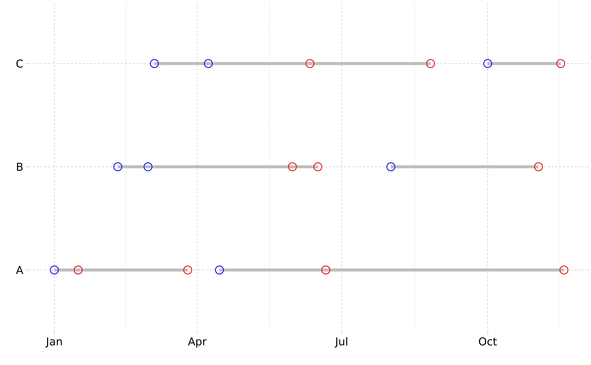
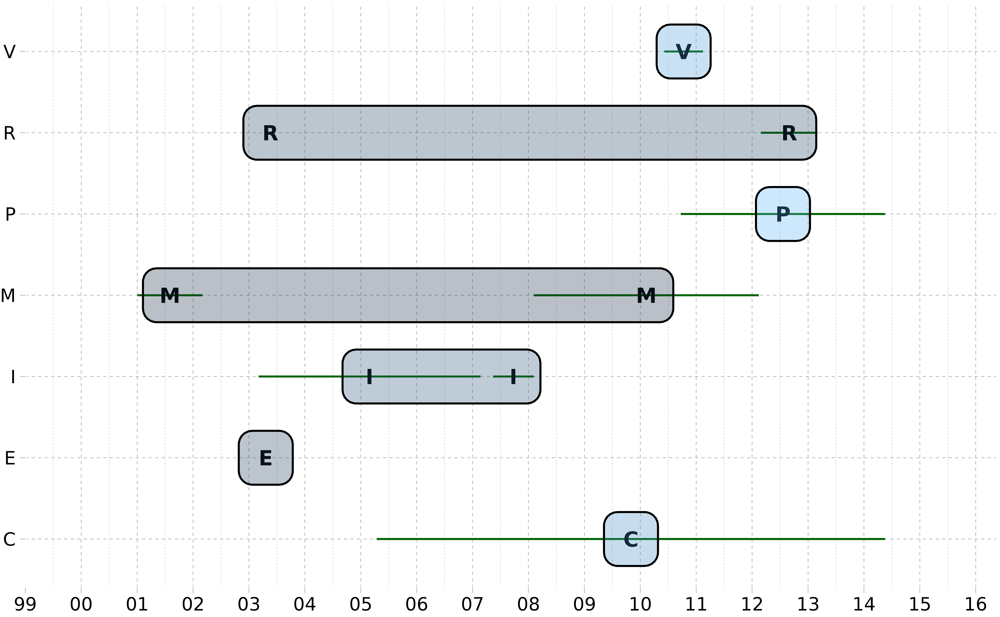

# Patient Scheduling

## Interval Vectors in R with `ivs`

- [ivs blog](https://blog.davisvaughan.com/posts/2022-04-20-ivs-0-1-0/)

  
  

### Find ranges of dates when an apartment is empty

Adapted from this [`ivs`
example](https://stackoverflow.com/questions/72536566/adding-rows-for-missing-intervals-between-existing-intervals-in-r/72547866#72547866)

- Convert to dates rather than date-times
- Add 1 to `end_date` to make ranges that match `[, )`, which is what
  `ivs` wants (and makes more sense here)
- For each apartment, compute the interval *complement* with
  `iv_set_complement()`. These are the empty dates (it keeps in mind any
  overlaps)
- Bind the complement with the original data and sort

The end dates in the final result will be +1 vs what is in your
`desired_outcome` but I find these interval problems are easier to think
about if you use right open intervals, `[, )`.

``` r
example_dates <- structure(
  list(
    apartment = c("A", "A", "A", "A", "B", "B", "B", "C", "C", "C"), 
    start_date = structure(
      c(
        1640995200, 1642291200, 1649980800, 1655769600, 1644451200,
        1646092800, 1659312000, 1646438400, 1649376000, 1664582400
      ), 
      class = c("POSIXct", "POSIXt"), 
      tzone = "UTC"
    ), 
    end_date = structure(
      c(
        1642204800, 1648166400, 1655683200, 1668643200, 1655251200, 
        1653868800, 1667260800, 1654819200, 1661385600, 1668470400
      ), 
      class = c("POSIXct", "POSIXt"), 
      tzone = "UTC"
    ), 
    status = c(
      "person in apartment", "person in apartment", "person in apartment", 
      "person in apartment", "person in apartment", "person in apartment",
      "person in apartment", "person in apartment", "person in apartment", 
      "person in apartment"
    )
  ), 
  class = c("tbl_df", "tbl", "data.frame"), 
  row.names = c(NA, -10L)
)

# Convert dates to dates rather than date-times
example_dates <- example_dates |>
  mutate(start_date = as.Date(start_date), 
         end_date = as.Date(end_date)) |>
  mutate(end_date = end_date + 1) # Make `end_date` exclusive

example_dates
```

    #> # A tibble: 10 × 4
    #>    apartment start_date end_date   status             
    #>    <chr>     <date>     <date>     <chr>              
    #>  1 A         2022-01-01 2022-01-16 person in apartment
    #>  2 A         2022-01-16 2022-03-26 person in apartment
    #>  3 A         2022-04-15 2022-06-21 person in apartment
    #>  4 A         2022-06-21 2022-11-18 person in apartment
    #>  5 B         2022-02-10 2022-06-16 person in apartment
    #>  6 B         2022-03-01 2022-05-31 person in apartment
    #>  7 B         2022-08-01 2022-11-02 person in apartment
    #>  8 C         2022-03-05 2022-06-11 person in apartment
    #>  9 C         2022-04-08 2022-08-26 person in apartment
    #> 10 C         2022-10-01 2022-11-16 person in apartment

``` r
ggplot(example_dates) + 
  geom_linerange(aes(xmin = start_date, 
                     xmax = end_date, 
                     y = apartment), linewidth = 1.25, color = "grey") +
  geom_point(aes(x = start_date, y = apartment), 
             colour = "blue", 
             #fill = "black", 
             #stroke = 1, 
             size = 3,
             shape = 21) +
  geom_point(aes(x = end_date, y = apartment), colour = "red", 
             #fill = "black", 
             size = 3,
             shape = 21) +
  ggthemes::geom_rangeframe() +
  ggthemes::theme_pander() +
  labs(x = "", y = "")
```



``` r
# Combine start/end into an interval vector
example_dates2 <- example_dates |>
  mutate(range = iv(start_date, end_date), .keep = "unused")

example_dates2
```

    #> # A tibble: 10 × 3
    #>    apartment status                                 range
    #>    <chr>     <chr>                             <iv<date>>
    #>  1 A         person in apartment [2022-01-01, 2022-01-16)
    #>  2 A         person in apartment [2022-01-16, 2022-03-26)
    #>  3 A         person in apartment [2022-04-15, 2022-06-21)
    #>  4 A         person in apartment [2022-06-21, 2022-11-18)
    #>  5 B         person in apartment [2022-02-10, 2022-06-16)
    #>  6 B         person in apartment [2022-03-01, 2022-05-31)
    #>  7 B         person in apartment [2022-08-01, 2022-11-02)
    #>  8 C         person in apartment [2022-03-05, 2022-06-11)
    #>  9 C         person in apartment [2022-04-08, 2022-08-26)
    #> 10 C         person in apartment [2022-10-01, 2022-11-16)

``` r
# Compute the complement per apartment
empty_dates <- example_dates2 |>
  group_by(apartment) |>
  summarise(range = iv_set_complement(range)) |>
  mutate(status = "apartment empty")

empty_dates
```

    #> # A tibble: 3 × 3
    #>   apartment                    range status         
    #>   <chr>                   <iv<date>> <chr>          
    #> 1 A         [2022-03-26, 2022-04-15) apartment empty
    #> 2 B         [2022-06-16, 2022-08-01) apartment empty
    #> 3 C         [2022-08-26, 2022-10-01) apartment empty

``` r
# Bind and sort
apt_dates <- bind_rows(example_dates2, empty_dates) |>
  arrange(apartment, range) |>
  mutate(start_date = iv_start(range), 
         end_date = iv_end(range), 
         .keep = "unused")
apt_dates
```

    #> # A tibble: 13 × 4
    #>    apartment status              start_date end_date  
    #>    <chr>     <chr>               <date>     <date>    
    #>  1 A         person in apartment 2022-01-01 2022-01-16
    #>  2 A         person in apartment 2022-01-16 2022-03-26
    #>  3 A         apartment empty     2022-03-26 2022-04-15
    #>  4 A         person in apartment 2022-04-15 2022-06-21
    #>  5 A         person in apartment 2022-06-21 2022-11-18
    #>  6 B         person in apartment 2022-02-10 2022-06-16
    #>  7 B         person in apartment 2022-03-01 2022-05-31
    #>  8 B         apartment empty     2022-06-16 2022-08-01
    #>  9 B         person in apartment 2022-08-01 2022-11-02
    #> 10 C         person in apartment 2022-03-05 2022-06-11
    #> 11 C         person in apartment 2022-04-08 2022-08-26
    #> 12 C         apartment empty     2022-08-26 2022-10-01
    #> 13 C         person in apartment 2022-10-01 2022-11-16

  
  

### Group hospital patient stay dates

Adapted from this [`ivs`
example](https://stackoverflow.com/questions/72188780/grouping-dates-in-r-to-create-patient-episodes/72189705#72189705)

``` r
df <- tribble(
  ~Patient.ID, ~Admitted.Date, ~Discharge.Date,
  810L,        "2020-12-15",    "2020-12-16",
  810L,        "2021-06-17",    "2021-06-19",
  810L,        "2021-06-19",    "2021-06-27",
  810L,        "2021-06-27",    "2021-07-03"
) |> 
  mutate(Admitted.Date = as.Date(Admitted.Date),
         Discharge.Date = as.Date(Discharge.Date))
df
```

    #> # A tibble: 4 × 3
    #>   Patient.ID Admitted.Date Discharge.Date
    #>        <int> <date>        <date>        
    #> 1        810 2020-12-15    2020-12-16    
    #> 2        810 2021-06-17    2021-06-19    
    #> 3        810 2021-06-19    2021-06-27    
    #> 4        810 2021-06-27    2021-07-03

``` r
# Create an interval vector combining the hospital stay as:
# [Admitted.Date, Discharge.Date)
df <- df |>
  mutate(Stay = iv(Admitted.Date, Discharge.Date), .keep = "unused")

df
```

    #> # A tibble: 4 × 2
    #>   Patient.ID                     Stay
    #>        <int>               <iv<date>>
    #> 1        810 [2020-12-15, 2020-12-16)
    #> 2        810 [2021-06-17, 2021-06-19)
    #> 3        810 [2021-06-19, 2021-06-27)
    #> 4        810 [2021-06-27, 2021-07-03)

``` r
# Assuming you have multiple patients, we will group by `Patient.ID`.
# Then compute the non-overlapping interval "groups" per patient with `iv_groups()`
df |>
  group_by(Patient.ID) |>
  reframe(Stay = iv_groups(Stay))
```

    #> # A tibble: 2 × 2
    #>   Patient.ID                     Stay
    #>        <int>               <iv<date>>
    #> 1        810 [2020-12-15, 2020-12-16)
    #> 2        810 [2021-06-17, 2021-07-03)

``` r
# You can also see which "group" each stay fell in by using `iv_identify_group()`
df |>
  group_by(Patient.ID) |>
  mutate(Group = iv_identify_group(Stay))
```

    #> # A tibble: 4 × 3
    #> # Groups:   Patient.ID [1]
    #>   Patient.ID                     Stay                    Group
    #>        <int>               <iv<date>>               <iv<date>>
    #> 1        810 [2020-12-15, 2020-12-16) [2020-12-15, 2020-12-16)
    #> 2        810 [2021-06-17, 2021-06-19) [2021-06-17, 2021-07-03)
    #> 3        810 [2021-06-19, 2021-06-27) [2021-06-17, 2021-07-03)
    #> 4        810 [2021-06-27, 2021-07-03) [2021-06-17, 2021-07-03)

  
  

### Find overlapping dates for each ID and create a new row for the overlap

[SO
example](https://stackoverflow.com/questions/46151452/find-overlapping-dates-for-each-id-and-create-a-new-row-for-the-overlap/71753687#71753687)

> I would like to find the overlapping dates for each ID and create a
> new row with the overlapping dates and also combine the characters
> (char) for the lines. It is possible that my data will have 2 overlaps
> and need 2 combinations of characters. eg. ERM

You can also use dplyr/tidyr along with the ivs package, which is a
package dedicated to working with interval vectors like you have here.
This allows you to combine your start/end dates into a single interval
column and use a variety of iv\_\*() functions on it, here we use
iv_identify_splits().

Understanding iv_identify_splits() can be a little tricky at first, so
I’d encourage you to take a look at the graphical representation of that
operation
[here](https://davisvaughan.github.io/ivs/reference/iv-splits.html#graphical-representation).

``` r
df3 <- tribble(
  ~ID,       ~date1,       ~date2, ~char,
  15L, "2003-04-05", "2003-05-06",   "E",
  15L, "2003-04-20", "2003-06-20",   "R",
  16L, "2001-01-02", "2002-03-04",   "M",
  17L, "2003-03-05", "2007-02-22",   "I",
  17L, "2005-04-15", "2014-05-19",   "C",
  17L, "2007-05-15", "2008-02-05",   "I",
  17L, "2008-02-05", "2012-02-14",   "M",
  17L, "2010-06-07", "2011-02-14",   "V",
  17L, "2010-09-22", "2014-05-19",   "P",
  17L, "2012-02-28", "2013-03-04",   "R"
) |>
  mutate(
    date1 = as.Date(date1),
    date2 = as.Date(date2),
    days = trunc(as.integer(date2 - date1) / 2),
    date_mid = date2 - lubridate::days(days)
  )

# Combine the start/stop endpoints into a single interval vector
df3 <- df3 |>
  mutate(interval = iv(date1, date2))

# Note that these are half-open intervals and you may need to adjust the end!
df3
```

    #> # A tibble: 10 × 7
    #>       ID date1      date2      char   days date_mid                   interval
    #>    <int> <date>     <date>     <chr> <dbl> <date>                   <iv<date>>
    #>  1    15 2003-04-05 2003-05-06 E        15 2003-04-21 [2003-04-05, 2003-05-06)
    #>  2    15 2003-04-20 2003-06-20 R        30 2003-05-21 [2003-04-20, 2003-06-20)
    #>  3    16 2001-01-02 2002-03-04 M       213 2001-08-03 [2001-01-02, 2002-03-04)
    #>  4    17 2003-03-05 2007-02-22 I       725 2005-02-27 [2003-03-05, 2007-02-22)
    #>  5    17 2005-04-15 2014-05-19 C      1660 2009-11-01 [2005-04-15, 2014-05-19)
    #>  6    17 2007-05-15 2008-02-05 I       133 2007-09-25 [2007-05-15, 2008-02-05)
    #>  7    17 2008-02-05 2012-02-14 M       735 2010-02-09 [2008-02-05, 2012-02-14)
    #>  8    17 2010-06-07 2011-02-14 V       126 2010-10-11 [2010-06-07, 2011-02-14)
    #>  9    17 2010-09-22 2014-05-19 P       667 2012-07-21 [2010-09-22, 2014-05-19)
    #> 10    17 2012-02-28 2013-03-04 R       185 2012-08-31 [2012-02-28, 2013-03-04)

``` r
ggplot(df3) + 
  geom_segment(aes(y = char, yend = char, x = date1, xend = date2), color = "darkgreen") +
  geom_text(aes(y = char, x = date_mid, label = char), fontface = "bold") + 
  # geom_point(aes(y = char, x = date_mid), shape = 23) +
  ggforce::geom_mark_rect(aes(y = char, x = date_mid, fill = date_mid, group = char)) +
  # ggforce::geom_mark_rect(aes(y = char, x = date2, fill = date2)) +
  # ggthemes::theme_few() + 
  # ggthemes::extended_range_breaks() +
  ggthemes::geom_rangeframe() +
  ggthemes::theme_pander() +
  scale_x_date(date_breaks = "1 year", date_labels = "%y", expand =  c(0.15, 0.15)) +
  labs(x = NULL, y = NULL) +
  theme(legend.position = "none")
```



``` r
# For each ID, compute the "splits" for each interval.
# This splits on all the endpoints and returns a list column
df33 <- df3 |>
  group_by(ID) |>
  mutate(splits = iv_identify_splits(interval))

print(df33, n = 3)
```

    #> # A tibble: 10 × 8
    #> # Groups:   ID [3]
    #>      ID date1      date2      char   days date_mid                   interval
    #>   <int> <date>     <date>     <chr> <dbl> <date>                   <iv<date>>
    #> 1    15 2003-04-05 2003-05-06 E        15 2003-04-21 [2003-04-05, 2003-05-06)
    #> 2    15 2003-04-20 2003-06-20 R        30 2003-05-21 [2003-04-20, 2003-06-20)
    #> 3    16 2001-01-02 2002-03-04 M       213 2001-08-03 [2001-01-02, 2002-03-04)
    #> # ℹ 7 more rows
    #> # ℹ 1 more variable: splits <list<iv<date>>>

``` r
# Note how the total range of the splits vector matches the
# range of the corresponding interval
df33$interval[[1]]
```

    #> <iv<date>[1]>
    #> [1] [2003-04-05, 2003-05-06)

``` r
df33$splits[[1]]
```

    #> <iv<date>[2]>
    #> [1] [2003-04-05, 2003-04-20) [2003-04-20, 2003-05-06)


``` r
# From there we can unchop() the splits column so we can group on it
df33 <- df33 |> unchop(splits)

# Note how rows 2 and 3 have the same `splits` value, so `E` and `R` will
# go together
df33
```

    #> # A tibble: 30 × 8
    #> # Groups:   ID [3]
    #>       ID date1      date2      char   days date_mid                   interval
    #>    <int> <date>     <date>     <chr> <dbl> <date>                   <iv<date>>
    #>  1    15 2003-04-05 2003-05-06 E        15 2003-04-21 [2003-04-05, 2003-05-06)
    #>  2    15 2003-04-05 2003-05-06 E        15 2003-04-21 [2003-04-05, 2003-05-06)
    #>  3    15 2003-04-20 2003-06-20 R        30 2003-05-21 [2003-04-20, 2003-06-20)
    #>  4    15 2003-04-20 2003-06-20 R        30 2003-05-21 [2003-04-20, 2003-06-20)
    #>  5    16 2001-01-02 2002-03-04 M       213 2001-08-03 [2001-01-02, 2002-03-04)
    #>  6    17 2003-03-05 2007-02-22 I       725 2005-02-27 [2003-03-05, 2007-02-22)
    #>  7    17 2003-03-05 2007-02-22 I       725 2005-02-27 [2003-03-05, 2007-02-22)
    #>  8    17 2005-04-15 2014-05-19 C      1660 2009-11-01 [2005-04-15, 2014-05-19)
    #>  9    17 2005-04-15 2014-05-19 C      1660 2009-11-01 [2005-04-15, 2014-05-19)
    #> 10    17 2005-04-15 2014-05-19 C      1660 2009-11-01 [2005-04-15, 2014-05-19)
    #> # ℹ 20 more rows
    #> # ℹ 1 more variable: splits <iv<date>>

``` r
# Group by (ID, splits) and paste the `char` column elements together
df33 |>
  group_by(ID, splits) |>
  summarise(char = paste0(char, collapse = ","), .groups = "drop")
```

    #> # A tibble: 15 × 3
    #>       ID                   splits char   
    #>    <int>               <iv<date>> <chr>  
    #>  1    15 [2003-04-05, 2003-04-20) E      
    #>  2    15 [2003-04-20, 2003-05-06) E,R    
    #>  3    15 [2003-05-06, 2003-06-20) R      
    #>  4    16 [2001-01-02, 2002-03-04) M      
    #>  5    17 [2003-03-05, 2005-04-15) I      
    #>  6    17 [2005-04-15, 2007-02-22) I,C    
    #>  7    17 [2007-02-22, 2007-05-15) C      
    #>  8    17 [2007-05-15, 2008-02-05) C,I    
    #>  9    17 [2008-02-05, 2010-06-07) C,M    
    #> 10    17 [2010-06-07, 2010-09-22) C,M,V  
    #> 11    17 [2010-09-22, 2011-02-14) C,M,V,P
    #> 12    17 [2011-02-14, 2012-02-14) C,M,P  
    #> 13    17 [2012-02-14, 2012-02-28) C,P    
    #> 14    17 [2012-02-28, 2013-03-04) C,P,R  
    #> 15    17 [2013-03-04, 2014-05-19) C,P

### Aggregate counts by month from start-stop ranged variables

``` r
enrollments <- tribble(
  ~unique_name, ~enrollment_start, ~enrollment_end,
  "Amy",        "1, Jan, 2017",    "30, Sep, 2018",
  "Franklin",   "1, Jan, 2017",    "19, Feb, 2017",
  "Franklin",   "5, Jun, 2017",    "4, Feb, 2018",
  "Franklin",   "21, Oct, 2018",   "9, Mar, 2019",
  "Samir",      "1, Jan, 2017",    "4, Feb, 2017",
  "Samir",      "5, Apr, 2017",    "12, Sep, 2018"
)

# Parse these into "day" precision year-month-day objects, then restrict
# them to just "month" precision because that is all we need
enrollments <- enrollments |> 
  mutate(
    start = enrollment_start |> 
      year_month_day_parse(format = "%d, %b, %Y") |> 
      calendar_narrow("month"),
    end = enrollment_end |> 
      year_month_day_parse(format = "%d, %b, %Y") |> 
      calendar_narrow("month") |> 
      add_months(1),
    .keep = "unused"
  )

enrollments
```

    #> # A tibble: 6 × 3
    #>   unique_name start        end         
    #>   <chr>       <ymd<month>> <ymd<month>>
    #> 1 Amy         2017-01      2018-10     
    #> 2 Franklin    2017-01      2017-03     
    #> 3 Franklin    2017-06      2018-03     
    #> 4 Franklin    2018-10      2019-04     
    #> 5 Samir       2017-01      2017-03     
    #> 6 Samir       2017-04      2018-10

``` r
# Create an interval vector, note that these are half-open intervals.
# The month on the RHS is not included, which is why we added 1 to `end` above.
enrollments <- enrollments |> 
  mutate(active = iv(start, end), 
         .keep = "unused")
enrollments
```

    #> # A tibble: 6 × 2
    #>   unique_name             active
    #>   <chr>         <iv<ymd<month>>>
    #> 1 Amy         [2017-01, 2018-10)
    #> 2 Franklin    [2017-01, 2017-03)
    #> 3 Franklin    [2017-06, 2018-03)
    #> 4 Franklin    [2018-10, 2019-04)
    #> 5 Samir       [2017-01, 2017-03)
    #> 6 Samir       [2017-04, 2018-10)

``` r
# We'll generate a sequence of months that will be part of the final result
bounds <- range(enrollments$active)
lower <- iv_start(bounds[[1]])
upper <- iv_end(bounds[[2]]) - 1L
months <- tibble(month = seq(lower, upper, by = 1))
months
```

    #> # A tibble: 27 × 1
    #>    month       
    #>    <ymd<month>>
    #>  1 2017-01     
    #>  2 2017-02     
    #>  3 2017-03     
    #>  4 2017-04     
    #>  5 2017-05     
    #>  6 2017-06     
    #>  7 2017-07     
    #>  8 2017-08     
    #>  9 2017-09     
    #> 10 2017-10     
    #> # ℹ 17 more rows

To actually compute the counts, use `iv_count_between()`, which counts
up all instances where `month[i]` is between any interval in
`enrollments$active`

``` r
months |> 
  mutate(count = iv_count_between(month, enrollments$active))
```

    #> # A tibble: 27 × 2
    #>    month        count
    #>    <ymd<month>> <int>
    #>  1 2017-01          3
    #>  2 2017-02          3
    #>  3 2017-03          1
    #>  4 2017-04          2
    #>  5 2017-05          2
    #>  6 2017-06          3
    #>  7 2017-07          3
    #>  8 2017-08          3
    #>  9 2017-09          3
    #> 10 2017-10          3
    #> # ℹ 17 more rows

### Number of records open in a month, in dataset containing single records with start / end dates

``` r
ds <- data.frame(
  record_id = c("00a", "00b", "00c"),
  record_start_date = as.Date(c("2020-01-16", "2020-03-25", "2020-02-22")),
  record_end_date = as.Date(c("2020-12-05", "2020-06-21", "2020-11-12"))
)

# Record the start and end months to generate the counts for
start <- date_start(min(ds$record_start_date), "year")
end <- date_end(max(ds$record_end_date), "year") + 1L

# Construct an interval vector
ds <- ds |> 
  mutate(
    record_range = iv(record_start_date, record_end_date), 
    .keep = "unused"
  )

ds
```

    #>   record_id             record_range
    #> 1       00a [2020-01-16, 2020-12-05)
    #> 2       00b [2020-03-25, 2020-06-21)
    #> 3       00c [2020-02-22, 2020-11-12)

``` r
# Generate the months sequence to count along
result <- tibble(
  month = date_seq(
    from = start, 
    to = end, 
    by = duration_months(1)
  )
)

# Count the number of times `month[[i]]` is between any of the
# ranges in `ds$record_range`
result |> 
  mutate(
    count = iv_count_between(month, ds$record_range)
  )
```

    #> # A tibble: 13 × 2
    #>    month      count
    #>    <date>     <int>
    #>  1 2020-01-01     0
    #>  2 2020-02-01     1
    #>  3 2020-03-01     2
    #>  4 2020-04-01     3
    #>  5 2020-05-01     3
    #>  6 2020-06-01     3
    #>  7 2020-07-01     2
    #>  8 2020-08-01     2
    #>  9 2020-09-01     2
    #> 10 2020-10-01     2
    #> 11 2020-11-01     2
    #> 12 2020-12-01     1
    #> 13 2021-01-01     0

### Generate new variable based on start and stop date

``` r
tb <- read.table(header = T, 
text = "   Machine   Start      Stop           ServiceType 
1       XX 2014-12-04       NA          AA
2       XX 2013-09-05 2013-11-05          BB
3       XX 2013-11-21 2014-09-25          BB
4       XX 2013-10-11 2014-11-18          BB
5       XX 2021-12-03       <NA>          AA
6       XX 2020-08-06 2022-09-15          AA
7       XX 2021-06-10       <NA>          BB
8       YY 2020-01-17       <NA>          BB
9       YY 2015-11-04 2018-04-30          BB
10      YY 2016-05-28 2019-03-21          BB
11      YY 2019-09-27       <NA>          BB
12      YY 2018-01-05       <NA>          AA
")
tb
```

    #>    Machine      Start       Stop ServiceType
    #> 1       XX 2014-12-04       <NA>          AA
    #> 2       XX 2013-09-05 2013-11-05          BB
    #> 3       XX 2013-11-21 2014-09-25          BB
    #> 4       XX 2013-10-11 2014-11-18          BB
    #> 5       XX 2021-12-03       <NA>          AA
    #> 6       XX 2020-08-06 2022-09-15          AA
    #> 7       XX 2021-06-10       <NA>          BB
    #> 8       YY 2020-01-17       <NA>          BB
    #> 9       YY 2015-11-04 2018-04-30          BB
    #> 10      YY 2016-05-28 2019-03-21          BB
    #> 11      YY 2019-09-27       <NA>          BB
    #> 12      YY 2018-01-05       <NA>          AA

``` r
tb|> 
  mutate(Stop = ifelse(Stop == "<NA>", Start, Stop),
         across(c(Start, Stop), ymd),
         Stop = if_else(Stop == Start, Stop + days(1), Stop),
         ivs = iv(Start, Stop)) |> 
  group_by(Machine, gp = iv_identify_group(ivs)) |> 
  summarise(ServiceType = toString(unique(ServiceType)), .groups = "drop") |> 
  mutate(gp = iv_start(gp),
         ServiceType = ifelse(ServiceType %in% c("BB, AA", "AA, BB"), 
                              "CC", ServiceType))
```

    #> # A tibble: 6 × 3
    #>   Machine gp         ServiceType
    #>   <chr>   <date>     <chr>      
    #> 1 XX      2013-09-05 BB         
    #> 2 XX      2020-08-06 CC         
    #> 3 XX      NA         AA         
    #> 4 YY      2015-11-04 CC         
    #> 5 YY      2019-09-27 BB         
    #> 6 YY      2020-01-17 BB

  
  

### Aggregate Data by Month using start and end dates to calculate monthly disease prevelance

``` r
ddf <- data.frame(patid=c("1","2","3","4","5","6","7"), 
                 
                 start_date=c("01/03/2016","24/08/2016", 
                              "01/01/2016","24/02/2016", 
                              "24/04/2016","01/04/2016", 
                              "01/09/2016"), 
                 
                 end_date=c("31/12/2016","31/12/2016", 
                            "23/12/2016","01/08/2016", 
                            "17/06/2016","04/05/2016", 
                            "31/10/2016"), 
                 
                 disease=c("yes","no","yes","no", 
                           "no","yes","yes"), 
                 
                 disease_date=c("15/08/2016",NA, 
                                "15/08/2016",NA,NA, 
                                "01/05/2016","31/10/2016"))
ddf
```

    #>   patid start_date   end_date disease disease_date
    #> 1     1 01/03/2016 31/12/2016     yes   15/08/2016
    #> 2     2 24/08/2016 31/12/2016      no         <NA>
    #> 3     3 01/01/2016 23/12/2016     yes   15/08/2016
    #> 4     4 24/02/2016 01/08/2016      no         <NA>
    #> 5     5 24/04/2016 17/06/2016      no         <NA>
    #> 6     6 01/04/2016 04/05/2016     yes   01/05/2016
    #> 7     7 01/09/2016 31/10/2016     yes   31/10/2016

Here’s a solution that uses ivs (for interval vectors), clock (for month
precision dates), and vctrs (for counting matches).

Note that ivs requires half-open intervals, which in practice means that
we add 1 to our “end” months before creating the interval vector.

The real stars of the show are:

vec_count_matches() to count each time a month appeared in disease_date,
which gives us our n_disease iv_count_between() to count each time a
month fell between a range, which gives us our n_total

``` r
# Only need these cols
ddf <- ddf |>
  select(start_date, end_date, disease_date)

# Turn into actual dates
ddf <- ddf |>
  mutate(
    across(everything(), \(col) {
      date_parse(col, format = "%d/%m/%Y")
    })
  )

# We really only need month based information, so drop the days
ddf <- ddf |>
  mutate(
    across(everything(), \(col) {
      calendar_narrow(as_year_month_day(col), "month")
    })
  )

# Turn the start/end dates into real ranges.
# Make them half-open ranges by adding 1 to the end date month
ddf <- ddf |>
  mutate(range = iv(start_date, end_date + 1L), .keep = "unused", .before = 1)

ddf
```

    #>                range disease_date
    #> 1 [2016-03, 2017-01)      2016-08
    #> 2 [2016-08, 2017-01)         <NA>
    #> 3 [2016-01, 2017-01)      2016-08
    #> 4 [2016-02, 2016-09)         <NA>
    #> 5 [2016-04, 2016-07)         <NA>
    #> 6 [2016-04, 2016-06)      2016-05
    #> 7 [2016-09, 2016-11)      2016-10

``` r
# Little helper to count the number of times each `needle` appears in `haystack`
vec_count_matches <- function(needles, haystack) {
  out <- vec_rep(0L, times = vec_size(needles))
  matches <- vec_locate_matches(needles, haystack, no_match = "drop")
  result <- vec_count(matches$needles, sort = "location")
  out[result$key] <- result$count
  out
}

# Create a full sequence from min month to max month
from <- min(iv_start(ddf$range))
to <- max(iv_end(ddf$range))

tibble(
  month = seq(from = from, to = to, by = 1),
  n_disease = vec_count_matches(month, ddf$disease_date),
  n_total = iv_count_between(month, ddf$range),
  prevalence = n_disease / n_total
)
```

    #> # A tibble: 13 × 4
    #>    month        n_disease n_total prevalence
    #>    <ymd<month>>     <int>   <int>      <dbl>
    #>  1 2016-01              0       1       0   
    #>  2 2016-02              0       2       0   
    #>  3 2016-03              0       3       0   
    #>  4 2016-04              0       5       0   
    #>  5 2016-05              1       5       0.2 
    #>  6 2016-06              0       4       0   
    #>  7 2016-07              0       3       0   
    #>  8 2016-08              2       4       0.5 
    #>  9 2016-09              0       4       0   
    #> 10 2016-10              1       4       0.25
    #> 11 2016-11              0       3       0   
    #> 12 2016-12              0       3       0   
    #> 13 2017-01              0       0     NaN

Update: And with the dev version of ivs (what will soon be 0.2.0), this
is even easier with iv_diff() and iv_count_includes(), which means you
don’t need the custom vec_count_matches() helper at all:

``` r
tibble(
  month = iv_diff(seq(from = from, to = to, by = 1)),
  n_disease = iv_count_includes(month, ddf$disease_date),
  n_total = iv_count_overlaps(month, ddf$range, type = "within"),
  prevalence = n_disease / n_total
)
```

    #> # A tibble: 12 × 4
    #>                 month n_disease n_total prevalence
    #>      <iv<ymd<month>>>     <int>   <int>      <dbl>
    #>  1 [2016-01, 2016-02)         0       1       0   
    #>  2 [2016-02, 2016-03)         0       2       0   
    #>  3 [2016-03, 2016-04)         0       3       0   
    #>  4 [2016-04, 2016-05)         0       5       0   
    #>  5 [2016-05, 2016-06)         1       5       0.2 
    #>  6 [2016-06, 2016-07)         0       4       0   
    #>  7 [2016-07, 2016-08)         0       3       0   
    #>  8 [2016-08, 2016-09)         2       4       0.5 
    #>  9 [2016-09, 2016-10)         0       4       0   
    #> 10 [2016-10, 2016-11)         1       4       0.25
    #> 11 [2016-11, 2016-12)         0       3       0   
    #> 12 [2016-12, 2017-01)         0       3       0

### Count instances of value within overlapping dates

I have a dataframe that includes start_date and end_date for a given
unit_id along with the unit’s group.

``` r
data.frame(
  unit_id = c(1, 2, 3),
  start_date = as.Date(c("2019-01-01", "2019-02-05", "2020-01-12")),
  end_date = as.Date(c("2019-02-06", "2019-02-28", "2020-01-30")),
  group = c("pass", "fail", "pass")
)
```

    #>   unit_id start_date   end_date group
    #> 1       1 2019-01-01 2019-02-06  pass
    #> 2       2 2019-02-05 2019-02-28  fail
    #> 3       3 2020-01-12 2020-01-30  pass

For each unit_id, I need to calculate the proportion of all units that
pass within the duration, start_date and end_date for the current
unit_id.

Taking unit_id=1 as an example, I need to find all units that have
start_date and/or end_date within the dates for unit 1, i.e. start_date
= 2019-01-01 and end_date = 2019-02-06. Given my in_df, this would
return two units, 1 and 2. One unit passes and one fails so the
proportion of pass would be 0.5. desired_df shows the output I expect
for this example.

``` r
data.frame(
  unit_id = c(1, 2, 3),
  start_date = as.Date(c("2019-01-01", "2019-02-05", "2020-01-12")),
  end_date = as.Date(c("2019-02-06", "2019-02-28", "2020-01-30")),
  group = c("pass", "fail", "pass"),
  pass_prop = c(0.5, 0.5, 1)
)
```

    #>   unit_id start_date   end_date group pass_prop
    #> 1       1 2019-01-01 2019-02-06  pass       0.5
    #> 2       2 2019-02-05 2019-02-28  fail       0.5
    #> 3       3 2020-01-12 2020-01-30  pass       1.0

I think ivs can help you, but I think you might be looking for
iv_locate_overlaps() here:

``` r
# Starting with the more complex example with the 4th row
in_df <- tibble(unit_id = c(1,2,3,4),
                start_date = as.Date(c("2019-01-01","2019-02-05","2020-01-12","2019-02-20")),
                end_date = as.Date(c("2019-02-06","2019-02-28","2020-01-30","2020-01-30")), 
                group = c("pass","fail","pass","pass"))

in_df <- in_df |>
  mutate(range = iv(start_date, end_date), .keep = "unused")

in_df
```

    #> # A tibble: 4 × 3
    #>   unit_id group                    range
    #>     <dbl> <chr>               <iv<date>>
    #> 1       1 pass  [2019-01-01, 2019-02-06)
    #> 2       2 fail  [2019-02-05, 2019-02-28)
    #> 3       3 pass  [2020-01-12, 2020-01-30)
    #> 4       4 pass  [2019-02-20, 2020-01-30)

``` r
# "find all units that have `start_date` and/or `end_date` within the dates for unit i"
# So you are looking for "any" kind of overlap.
# `iv_locate_overlaps()` does: "For each `needle`, find every location in `haystack`
# where that `needle` has ANY overlap at all"
locs <- iv_locate_overlaps(
  needles = in_df$range, 
  haystack = in_df$range, 
  type = "any"
)

# Note `needle` 1 overlaps `haystack` locations 1 and 2 (which is what you said
# you want for unit 1)
locs
```

    #>    needles haystack
    #> 1        1        1
    #> 2        1        2
    #> 3        2        1
    #> 4        2        2
    #> 5        2        4
    #> 6        3        3
    #> 7        3        4
    #> 8        4        2
    #> 9        4        3
    #> 10       4        4

``` r
# Slice `in_df` appropriately, keeping relevant columns needed to answer the question
needles <- in_df[locs$needles, c("unit_id", "range")]
haystack <- in_df[locs$haystack, c("group", "range")]
haystack <- rename(haystack, overlaps = range)

expanded_df <- bind_cols(needles, haystack)
expanded_df
```

    #> # A tibble: 10 × 4
    #>    unit_id                    range group                 overlaps
    #>      <dbl>               <iv<date>> <chr>               <iv<date>>
    #>  1       1 [2019-01-01, 2019-02-06) pass  [2019-01-01, 2019-02-06)
    #>  2       1 [2019-01-01, 2019-02-06) fail  [2019-02-05, 2019-02-28)
    #>  3       2 [2019-02-05, 2019-02-28) pass  [2019-01-01, 2019-02-06)
    #>  4       2 [2019-02-05, 2019-02-28) fail  [2019-02-05, 2019-02-28)
    #>  5       2 [2019-02-05, 2019-02-28) pass  [2019-02-20, 2020-01-30)
    #>  6       3 [2020-01-12, 2020-01-30) pass  [2020-01-12, 2020-01-30)
    #>  7       3 [2020-01-12, 2020-01-30) pass  [2019-02-20, 2020-01-30)
    #>  8       4 [2019-02-20, 2020-01-30) fail  [2019-02-05, 2019-02-28)
    #>  9       4 [2019-02-20, 2020-01-30) pass  [2020-01-12, 2020-01-30)
    #> 10       4 [2019-02-20, 2020-01-30) pass  [2019-02-20, 2020-01-30)

``` r
# Compute the pass proportion per unit
expanded_df |>
  group_by(unit_id) |>
  summarise(pass_prop = sum(group == "pass") / length(group))
```

    #> # A tibble: 4 × 2
    #>   unit_id pass_prop
    #>     <dbl>     <dbl>
    #> 1       1     0.5  
    #> 2       2     0.667
    #> 3       3     1    
    #> 4       4     0.667
