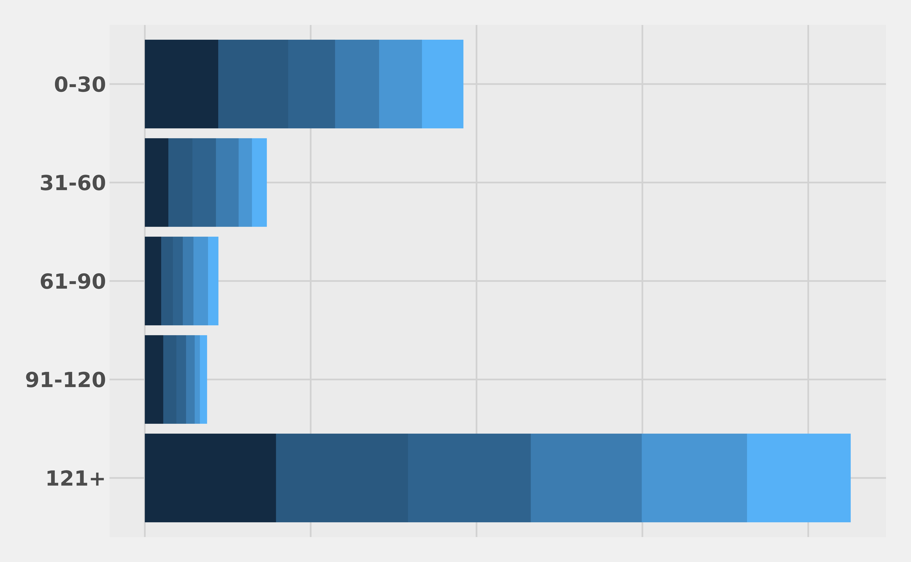

# Tests

## Aging Over 3 Months

``` r
load_ex("old_azalea") |> 
  select(-starts_with("bin")) |> 
  mutate(rep_mon = factor(rep_mon, levels = month.abb, ordered = TRUE),
         aging_bin = factor(aging_bin, levels = sort(unique(aging_bin)), ordered = TRUE)) |> 
  gt::gt_preview() |> 
  opt_table_font(font = google_font(name = "Fira Code"))
```

|         | rep_date   | rep_mon | pid    | dos        | aging_bin | balance | ins_class  | ins_name | days_in_ar |
|---------|------------|---------|--------|------------|-----------|---------|------------|----------|------------|
| 1       | 2021-07-31 | Jul     | 1:1    | 2021-06-29 | 31-60     | 253.0   | Commercial | Meritain | 32         |
| 2       | 2021-08-31 | Aug     | 1:1    | 2021-06-29 | 61-90     | 253.0   | Commercial | Meritain | 63         |
| 3       | 2021-07-31 | Jul     | 1:2    | 2021-07-01 | 0-30      | 36.5    | Commercial | Meritain | 30         |
| 4       | 2021-08-31 | Aug     | 1:2    | 2021-07-01 | 61-90     | 36.5    | Commercial | Meritain | 61         |
| 5       | 2021-07-31 | Jul     | 2:1    | 2021-06-29 | 31-60     | 36.5    | Commercial | Meritain | 32         |
| 6..4486 |            |         |        |            |           |         |            |          |            |
| 4487    | 2021-08-31 | Aug     | 1095:1 | 2021-08-08 | 0-30      | 150.0   | Commercial | BCBS     | 23         |

``` r
biweekly <- load_ex("aging_biweekly") |>
  mutate(year = get_year(date), 
         month = date_month_factor(date, abbreviate = TRUE), 
         .after = date) |> 
  arrange(date, aging_bin)

ggplot(data = biweekly, 
       aes(x = forcats::fct_rev(aging_bin), y = balance, fill = date)) +
  geom_col(position = position_stack(reverse = TRUE)) +
  # geom_col(position = position_fill(reverse = TRUE)) +
  coord_flip(clip = "off") +
  labs(title = NULL, x = NULL) + 
  ggthemes::scale_color_fivethirtyeight() +
  ggthemes::theme_fivethirtyeight(base_size = 10) +
  theme(legend.position = "none",
        axis.text.x = element_blank(),
        axis.text.y = element_text(size = 12, face = "bold")
        )
```



``` r
agingex <- load_ex("aging_ex")[1:4] |> 
  days_between(dos) |> 
  bin_aging(days_elapsed) |>
  mutate(year = get_year(dos), 
         quarter = get_quarter(as_year_quarter_day(dos)),
         month = date_month_factor(dos), 
         .after = dos)

agingex |>
  gt::gt_preview() |> 
  opt_table_font(font = google_font(name = "Fira Code"))
```

|         | dos        | year | quarter | month    | charges | ins_name   | ins_class | days_elapsed | aging_bin |
|---------|------------|------|---------|----------|---------|------------|-----------|--------------|-----------|
| 1       | 2023-12-27 | 2023 | 4       | December | 389.70  | Medicare   | Primary   | 813          | 121+      |
| 2       | 2023-12-27 | 2023 | 4       | December | 172.72  | Patient    | Patient   | 813          | 121+      |
| 3       | 2023-12-27 | 2023 | 4       | December | 246.46  | Blue Cross | Primary   | 813          | 121+      |
| 4       | 2023-12-27 | 2023 | 4       | December | 507.45  | AETNA      | Primary   | 813          | 121+      |
| 5       | 2023-12-27 | 2023 | 4       | December | 483.09  | Blue Cross | Primary   | 813          | 121+      |
| 6..2617 |            |      |         |          |         |            |           |              |           |
| 2618    | 2024-05-07 | 2024 | 2       | May      | 583.24  | Medicare   | Secondary | 681          | 121+      |

``` r
load_ex("aging_facility") |> 
  gt::gt_preview() |> 
  opt_table_font(font = google_font(name = "Fira Code"))
```

|          | pt_id  | pt_name          | pt_class   | pt_type    | date_admitted | date_discharged | date_billed | date_report | facility | service        | ins_class        | ins_name          | status            | balance | charges | aging_bin |
|----------|--------|------------------|------------|------------|---------------|-----------------|-------------|-------------|----------|----------------|------------------|-------------------|-------------------|---------|---------|-----------|
| 1        | p01497 | FISCHER, AARON   | Outpatient | Outpatient | 2019-06-01    | 2019-06-01      | NA          | 2019-06-01  | A        | OTHER          | Medicare         | Medicare          | DNFB: In Suspense | 657.0   | 657.0   | 0-30      |
| 2        | p02215 | SKEEN, AARON     | Outpatient | Outpatient | 2019-06-01    | 2019-06-01      | NA          | 2019-06-01  | A        | OTHER          | Managed Medicare | Anthem            | DNFB: In Suspense | 830.0   | 830.0   | 0-30      |
| 3        | p04132 | CONFALONE, AARON | Outpatient | Outpatient | 2019-06-01    | 2019-06-01      | NA          | 2019-06-01  | A        | OTHER          | Dual Eligible    | United Healthcare | DNFB: In Suspense | 580.0   | 580.0   | 0-30      |
| 4        | p00919 | SULLIVAN, AARON  | Outpatient | Outpatient | 2019-06-01    | 2019-06-01      | NA          | 2019-06-01  | A        | OTHER          | Medicare         | Medicare          | DNFB: In Suspense | 1452.0  | 1452.0  | 0-30      |
| 5        | p08723 | HINKLE, ABDOUL   | Emergency  | Emergency  | 2019-05-15    | 2019-05-15      | 2019-05-24  | 2019-06-01  | A        | EMERGENCY DEPT | Managed Medicare | Aetna             | Final Bill        | 75.0    | 1885.4  | 0-30      |
| 6..19999 |        |                  |            |            |               |                 |             |             |          |                |                  |                   |                   |         |         |           |
| 20000    | p08316 | BENTLEY, VALERIE | Emergency  | Emergency  | 2018-05-16    | 2018-05-16      | 2019-05-31  | 2019-06-01  | B        | EMERGENCY DEPT | Managed Medicaid | Medicare          | Final Bill        | 744.6   | 876.0   | 0-30      |

``` r
load_ex("aging_monthly") |> 
  gt::gt_preview() |> 
  opt_table_font(font = google_font(name = "Fira Code"))
```

|     | date       | mon | total     | change_abs | change_pct   | change_ror |
|-----|------------|-----|-----------|------------|--------------|------------|
| 1   | 2023-12-01 | Dec | 1132783.1 | 0.00       | 0.000000000  | 1.0000000  |
| 2   | 2024-01-01 | Jan | 942482.2  | -190300.84 | -0.167994068 | 0.8320059  |
| 3   | 2024-02-01 | Feb | 949739.9  | 7257.64    | 0.007700559  | 1.0077006  |
| 4   | 2024-03-01 | Mar | 985444.7  | 35704.80   | 0.037594293  | 1.0375943  |
| 5   | 2024-04-01 | Apr | 888797.4  | -96647.28  | -0.098074789 | 0.9019252  |
| 6   | 2024-05-01 | May | 808376.9  | -80420.46  | -0.090482329 | 0.9095177  |

``` r
load_ex("cppm_ex") |> 
  gt::gt_preview() |> 
  opt_table_font(font = google_font(name = "Fira Code"))
```

|       | date       | gross_charges | ending_ar | adjustments | collections |
|-------|------------|---------------|-----------|-------------|-------------|
| 1     | 2023-01-01 | 372026.2      | 558039.3  | 139546.2    | 227526.5    |
| 2     | 2023-02-01 | 488189.8      | 562992.8  | 215187.3    | 277845.5    |
| 3     | 2023-03-01 | 486557.1      | 558149.8  | 198306.2    | 282550.5    |
| 4     | 2023-04-01 | 372933.4      | 563850.2  | 145408.8    | 228277.5    |
| 5     | 2023-05-01 | 407866.8      | 563097.3  | 144358.1    | 256721.1    |
| 6..15 |            |               |           |             |             |
| 16    | 2024-04-01 | 384729.4      | 624732.1  | 142708.4    | 230923.0    |

``` r
load_ex("healthyr") |> 
  gt::gt_preview() |> 
  opt_table_font(font = google_font(name = "Fira Code"))
```

|           | pid      | visit | dos        | payer           | charges  | adjustment | payment   | balance | closed |
|-----------|----------|-------|------------|-----------------|----------|------------|-----------|---------|--------|
| 1         | 43395590 | 1     | 2014-01-04 | Blue Cross      | 8676.86  | -7136.73   | -1540.13  | 0       | TRUE   |
| 2         | 55897373 | 1     | 2014-01-04 | Medicare Part B | 8788.02  | -7663.57   | -1124.45  | 0       | TRUE   |
| 3         | 60856527 | 1     | 2014-01-04 | Aetna           | 22774.05 | -12978.37  | -9795.68  | 0       | TRUE   |
| 4         | 80673110 | 1     | 2014-01-04 | Humana          | 10690.45 | -7596.09   | -3094.36  | 0       | TRUE   |
| 5         | 86069614 | 1     | 2014-01-04 | Medicare Part B | 25983.88 | -20799.61  | -5184.27  | 0       | TRUE   |
| 6..187720 |          |       |            |                 |          |            |           |         |        |
| 187721    | 90493877 | 1     | 2024-05-22 | Blue Cross      | 40651.94 | -20967.17  | -19134.77 | 550     | FALSE  |

``` r
load_ex("monthly_raw") |> 
  gt::gt_preview() |> 
  opt_table_font(font = google_font(name = "Fira Code"))
```

|       | date       | gross_charges | ending_ar | net_payment | adjustments | point_of_service | avg_days_to_bill | patients_encounters | patients_unique | patients_new | em_visits | rvu_total |
|-------|------------|---------------|-----------|-------------|-------------|------------------|------------------|---------------------|-----------------|--------------|-----------|-----------|
| 1     | 2024-01-01 | 325982.0      | 288432.5  | 104181.64   | 170173.76   | 16012.80         | 5.33             | 1568                | 1204            | 129          | 1184      | 1564.50   |
| 2     | 2024-02-01 | 297731.7      | 307871.1  | 124548.88   | 153744.30   | 16304.75         | 8.08             | 1473                | 1162            | 120          | 1130      | 1474.35   |
| 3     | 2024-03-01 | 198655.1      | 253976.6  | 119445.53   | 133104.13   | 10844.50         | 6.07             | 1031                | 758             | 61           | 813       | 995.60    |
| 4     | 2024-04-01 | 186047.0      | 183684.9  | 71756.18    | 84582.48    | 1824.07          | 3.76             | 553                 | 428             | 32           | 427       | 517.34    |
| 5     | 2024-05-01 | 123654.0      | 204227.6  | 50112.23    | 52999.08    | 6240.95          | 2.61             | 713                 | 609             | 123          | 550       | 739.50    |
| 6..11 |            |               |           |             |             |                  |                  |                     |                 |              |           |           |
| 12    | 2024-12-01 | 169094.5      | 199849.3  | 69030.83    | 62971.82    | 10461.59         | 3.40             | 834                 | 670             | 95           | 662       | 911.65    |

``` r
load_ex("denials_extract") |> 
  gt::gt_preview() |> 
  opt_table_font(font = google_font(name = "Fira Code"))
```

|          | facility   | claim_number | patient_name     | patient_id | period     | admit_date | discharge_date | original_bill_date | denial_date | denial_code                                               | denial_root_cause             | denial_rollup                 | denial_root_cause_department | impactable_denial_flag | denial_type | claim_amount | denial_amount | admit_location | patient_class | medical_service | denying_financial_class | denying_insurance_rollup | denying_insurance_code          |
|----------|------------|--------------|------------------|------------|------------|------------|----------------|--------------------|-------------|-----------------------------------------------------------|-------------------------------|-------------------------------|------------------------------|------------------------|-------------|--------------|---------------|----------------|---------------|-----------------|-------------------------|--------------------------|---------------------------------|
| 1        | Hospital A | 21           | HEWITT, DANIELLE | 2008016898 | 2017-08-01 | 2017-03-25 | 2017-03-25     | 2017-03-25         | 2017-08-29  | 29 - The time limit for filing has expired.               | Past Timely Filing Limits     | Past Timely Filing Limits     | Patient Financial Services   | Y                      | Technical   | 855          | 650.0         | EMERGENCY DEPT | Outpatient    | OTH - OTHER     | Contracted Commercial   | Anthem                   | ABA-EAS - ANTHEM BENEFITS ADMIN |
| 2        | Hospital A | 21           | HEWITT, DANIELLE | 2008016898 | 2017-08-01 | 2017-03-25 | 2017-03-25     | 2017-03-25         | 2017-08-07  | 29 - The time limit for filing has expired.               | Past Timely Filing Limits     | Past Timely Filing Limits     | Patient Financial Services   | Y                      | Technical   | 745          | 1025.0        | EMERGENCY DEPT | Outpatient    | OTH - OTHER     | Contracted Commercial   | Anthem                   | ABA-EAS - ANTHEM BENEFITS ADMIN |
| 3        | Hospital A | 21           | HEWITT, DANIELLE | 2008016898 | 2017-08-01 | 2017-03-25 | 2017-03-25     | 2017-03-25         | 2017-08-30  | 29 - The time limit for filing has expired.               | Past Timely Filing Limits     | Past Timely Filing Limits     | Patient Financial Services   | Y                      | Technical   | 745          | 1225.0        | EMERGENCY DEPT | Outpatient    | OTH - OTHER     | Contracted Commercial   | Anthem                   | ABA-EAS - ANTHEM BENEFITS ADMIN |
| 4        | Hospital A | 21           | HEWITT, DANIELLE | 2008016898 | 2017-08-01 | 2017-03-25 | 2017-03-25     | 2017-03-25         | 2017-08-01  | 29 - The time limit for filing has expired.               | Past Timely Filing Limits     | Past Timely Filing Limits     | Patient Financial Services   | Y                      | Technical   | 855          | 1850.0        | EMERGENCY DEPT | Outpatient    | OTH - OTHER     | Contracted Commercial   | Anthem                   | ABA-EAS - ANTHEM BENEFITS ADMIN |
| 5        | Hospital A | 21           | HEWITT, DANIELLE | 2008016898 | 2017-08-01 | 2017-03-25 | 2017-03-25     | 2017-03-25         | 2017-08-14  | 29 - The time limit for filing has expired.               | Past Timely Filing Limits     | Past Timely Filing Limits     | Patient Financial Services   | Y                      | Technical   | 855          | 1100.0        | EMERGENCY DEPT | Outpatient    | OTH - OTHER     | Contracted Commercial   | Anthem                   | ABA-EAS - ANTHEM BENEFITS ADMIN |
| 6..19999 |            |              |                  |            |            |            |                |                    |             |                                                           |                               |                               |                              |                        |             |              |               |                |               |                 |                         |                          |                                 |
| 20000    | Hospital B | 1669         | SHRIDER, BETH    | 8415569891 | 2017-10-01 | 2017-04-06 | 2018-08-04     | 2018-08-08         | 2017-10-22  | 197 - Precertification/authorization/notification absent. | Invalid/Missing Authorization | Invalid/Missing Authorization | Patient Access               | Y                      | Clinical    | 239          | 125.1         | DIALYSIS       | Recurring     | OTH - OTHER     | Commercial              | NA                       | CM9-EAS - SUMMACARE MYCARE DU   |

``` r
load_ex("nm_examples")$collections |> 
  gt::gt_preview() |> 
  opt_table_font(font = google_font(name = "Fira Code"))
```

|          | patient          | procedure | dos        | balance | payer      | ins_class | state | referring                | rendering |
|----------|------------------|-----------|------------|---------|------------|-----------|-------|--------------------------|-----------|
| 1        | Holland, Wilbert | 73336     | 2017-12-13 | 692.09  | Patient    | Patient   | CA    | Dr. Defying Gravity      | Dr. Milk  |
| 2        | Daniel, Albert   | 28682     | 2018-12-12 | 333.98  | Patient    | Patient   | AZ    | Dr. Dear Old Shiz        | Dr. Cake  |
| 3        | Fuller, Ora      | 62019     | 2017-09-05 | 356.64  | CIGNA      | Tertiary  | NM    | Dr. The Wizard and I     | Dr. Chip  |
| 4        | Chavez, Allan    | 65944     | 2018-06-05 | 43.34   | Blue Cross | Primary   | CA    | Dr. What is this Feeling | Dr. Milk  |
| 5        | Holloway, Lionel | 69716     | 2017-10-09 | 326.60  | Medicare   | Primary   | CA    | Dr. What is this Feeling | Dr. Milk  |
| 6..14999 |                  |           |            |         |            |           |       |                          |           |
| 15000    | Austin, Sheldon  | 35233     | 2018-04-26 | 805.05  | AETNA      | Primary   | WA    | Dr. Defying Gravity      | Dr. Cake  |

``` r
load_ex("nm_examples")$em_visits |> 
  gt::gt_preview() |> 
  opt_table_font(font = google_font(name = "Fira Code"))
```

|          | patient          | dos        | dob        | hcpcs_code | em_level | payer    | city      | state | referring   | rendering    |
|----------|------------------|------------|------------|------------|----------|----------|-----------|-------|-------------|--------------|
| 1        | Johnston, Ashley | 2018-05-05 | 1963-05-05 | 99213      | 3        | UHC      | Nashville | TN    | Dr. Brady   | Dr. Dominion |
| 2        | Harper, Angelica | 2018-10-10 | 1965-10-10 | 99212      | 2        | Vista    | Raleigh   | NC    | Dr. Brady   | Dr. Spice    |
| 3        | Steele, Tony     | 2018-05-09 | 1971-05-09 | 99213      | 3        | UHC      | Miami     | FL    | Dr. Hanks   | Dr. Bay      |
| 4        | Rose, Cassandra  | 2018-10-16 | 1936-10-16 | 99204      | 4        | CIGNA    | Nashville | TN    | Dr. Petty   | Dr. Spice    |
| 5        | Stephens, Janie  | 2018-12-01 | 1971-12-01 | 99204      | 4        | BCBS     | Raleigh   | NC    | Dr. Cruise  | Dr. Spice    |
| 6..11999 |                  |            |            |            |          |          |           |       |             |              |
| 12000    | Smith, Fernando  | 2018-03-31 | 1964-03-31 | 99213      | 3        | Coventry | Atlanta   | GA    | Dr. Selleck | Dr. Dominion |

``` r
load_ex("nm_examples")$reimbursement |> 
  gt::gt_preview() |> 
  opt_table_font(font = google_font(name = "Fira Code"))
```

|         | patient        | dos        | hcpcs_code | payer      | charges | allowed | adjustment | rendering     |
|---------|----------------|------------|------------|------------|---------|---------|------------|---------------|
| 1       | Powers, Billy  | 2016-06-16 | 15757      | Patient    | 6603    | 2320.60 | 4282.40    | Dr. Japanese  |
| 2       | Thomas, Eula   | 2017-03-02 | 61522      | Medicare   | 4003    | 1962.10 | 2040.90    | Dr. Norway    |
| 3       | Jensen, Jenna  | 2018-12-30 | 35122      | Patient    | 6570    | 2157.40 | 4412.60    | Dr. Sugar     |
| 4       | Perez, Jeffery | 2016-10-18 | G0392      | Blue Cross | 5754    | 2488.74 | 3265.26    | Dr. Paperbark |
| 5       | Murphy, Denise | 2017-07-17 | 52648      | Blue Cross | 5570    | 2627.39 | 2942.61    | Dr. Red       |
| 6..7999 |                |            |            |            |         |         |            |               |
| 8000    | Santos, Amelia | 2017-05-05 | 42894      | AETNA      | 6283    | 2628.36 | 3654.64    | Dr. Sycamore  |

``` r
load_ex("nm_examples")$last_referral |> 
  gt::gt_preview() |> 
  opt_table_font(font = google_font(name = "Fira Code"))
```

|        | referring_physician | rendering_physician | date_last_referral | location     | specialty        |
|--------|---------------------|---------------------|--------------------|--------------|------------------|
| 1      | Dr. Tomatoes        | Dr. Chip            | 2018-06-29         | New York     | General Surgery  |
| 2      | Dr. Tomatoes        | Dr. Cake            | 2018-06-09         | Marine Corps | Medical Oncology |
| 3      | Dr. Salt            | Dr. Cake            | 2018-06-23         | Honolulu     | General Surgery  |
| 4      | Dr. Garlic          | Dr. Mousse          | 2018-10-13         | New York     | Urology          |
| 5      | Dr. Cilantro        | Dr. Cake            | 2018-08-17         | Boston       | Medical Oncology |
| 6..137 |                     |                     |                    |              |                  |
| 138    | Dr. Lime Juice      | Dr. Mousse          | 2018-09-09         | Marine Corps | Urology          |

``` r
load_ex("patient_aging") |> 
  gt::gt_preview() |> 
  opt_table_font(font = google_font(name = "Fira Code"))
```

|         | pid   | class_pid | dob        | date_bill_first | date_bill_last | date_pay_last | days_bill_first | days_bill_last | days_pay_last | amt_pay_last | ins_prim                | class_prim           | ins_sec          | class_sec  | bin_0_30 | bin_31_60 | bin_61_90 | bin_91_120 | bin_121 | aging_total | disabled_statements |
|---------|-------|-----------|------------|-----------------|----------------|---------------|-----------------|----------------|---------------|--------------|-------------------------|----------------------|------------------|------------|----------|-----------|-----------|------------|---------|-------------|---------------------|
| 1       | 55267 | NA        | 1936-12-16 | 2023-07-27      | 2024-02-22     | NA            | 229             | 19             | NA            | NA           | AETNA                   | AETNA                | NA               | NA         | NA       | NA        | NA        | NA         | 20      | 20.00       | FALSE               |
| 2       | 55001 | NA        | 1960-04-02 | 2023-07-13      | 2024-02-15     | NA            | 243             | 26             | NA            | NA           | KANSAS MEDICARE         | MEDICARE             | BCBS OF MISSOURI | BCBS       | NA       | NA        | NA        | NA         | 20      | 20.00       | FALSE               |
| 3       | 53733 | NA        | 1998-01-29 | 2023-12-08      | 2024-02-15     | NA            | 94              | 26             | NA            | NA           | OPTUM BEHAVIORAL HEALTH | UBH                  | NA               | NA         | NA       | NA        | NA        | 200        | NA      | 200.00      | FALSE               |
| 4       | 54356 | NA        | 1954-12-26 | 2023-05-25      | 2024-03-08     | NA            | 292             | 4              | NA            | NA           | KANSAS MEDICARE         | MEDICARE             | AMERICO          | COMMERCIAL | NA       | NA        | NA        | NA         | 20      | 20.00       | FALSE               |
| 5       | 52242 | NA        | 2006-02-08 | 2024-02-09      | 2024-02-09     | NA            | 31              | 32             | NA            | NA           | UNITED HEALTHCARE       | COMMERCIAL           | NA               | NA         | NA       | 156.33    | NA        | NA         | NA      | 156.33      | FALSE               |
| 6..1716 |       |           |            |                 |                |               |                 |                |               |              |                         |                      |                  |            |          |           |           |            |         |             |                     |
| 1717    | 56337 | NA        | 1941-02-21 | NA              | NA             | NA            | 0               | NA             | NA            | NA           | AARP HEALTHCARE OPTIONS | MEDICARE REPLACEMENT | NA               | NA         | 1050     | NA        | NA        | NA         | NA      | 1050.00     | FALSE               |

``` r
load_ex("transaction_data") |> 
  gt::gt_preview() |> 
  opt_table_font(font = google_font(name = "Fira Code"))
```

|         | post_date  | transaction_rollup | financial_class       | sum_transaction_amount | facility |
|---------|------------|--------------------|-----------------------|------------------------|----------|
| 1       | 2018-01-01 | Charges            | Self Pay              | 0                      | A        |
| 2       | 2018-01-01 | Charges            | Medicare              | 7980119                | A        |
| 3       | 2018-01-01 | Charges            | Commercial            | 11586168               | A        |
| 4       | 2018-01-01 | Charges            | Commercial            | 1978268                | A        |
| 5       | 2018-01-01 | Charges            | Contracted Commercial | 7503348                | A        |
| 6..3173 |            |                    |                       |                        |          |
| 3174    | 2018-12-01 | Other              | Medicare              | 0                      | B        |
